# Avant de commencer

Ce manuel accompagne la version publique d’[Orbit](https://orbit.securedme.ca/). Il sert à apprendre en manipulant, puis à guider un étudiant dans une expérience comparable. Sa première partie explique la scène et les quinze jeux. Sa seconde partie transforme ces mécanismes en activités, avec prédictions, essais et critères de compréhension. Les corrigés sont séparés des consignes pour laisser une vraie tentative.

**Statut : exemplaire de travail pour revue.** Le code a été inspecté et les comportements couverts par la validation cloud sont indiqués dans l’annexe. Les réponses de l’étudiant et votre propre apprentissage restent à documenter. Aucun résultat de jeu ne devient automatiquement une preuve de maîtrise.

Le nom d’atome désigne notre sculpture interactive. Les orbites, le vortex, les portails et les traces sont des constructions visuelles. **Le site ne calcule pas une simulation quantique.** Les unités de scène servent à régler l’effet ; elles ne sont pas des mètres ou des grandeurs atomiques mesurées.

## Contribution et autorité

Codex a contribué comme **partenaire de recherche** à la cartographie du code, à la comparaison des sources, à l’organisation des preuves, aux contrôles de cohérence, au contrôle éditorial et à la préparation des livrables. Jean-Sébastien définit l’intention et le périmètre, et conserve l’autorité sur l’interprétation des résultats, l’arbitrage des conclusions et toute décision publique. Le jugement, la responsabilité, la qualité d’auteur et la signature finale restent sous son autorité. Les textes à la première personne ci-dessous sont des propositions de lecture à adapter, et non des déclarations d’apprentissage déjà validées.

## Mode d’emploi

Ouvrez Orbit. Dès l’arrivée, le pointeur anime un vortex ; les jeux Écho et Remonter le temps restent des activités volontaires, absentes de l’accueil. Le mouvement réduit limite les effets automatiques.

Pour isoler un mécanisme, utilisez **JOUER → 15 jeux**. Vortex est sélectionné en premier. La liste et les flèches permettent de changer de jeu. **Essayer le geste** montre une démonstration ; **Effacer** nettoie les données du jeu ; **Retour** ou **Échap** ramène au landing. Pour une observation de votre geste, faites un essai manuel après la démonstration. Empreinte utilise **Enregistrer PNG**.

Il existe deux gestes de base : agripper près du noyau le déplace et le tourne ; tirer le fond oriente l’atome. Le jeu Remonter le temps réserve le maintien du fond au retour dans son historique. Les jeux Fronde, Cordes, Élastique, Vortex, Constellation et Collection réservent le pointeur à leur propre mécanisme. Le tactile utilise les mêmes événements Pointer Events. Les commandes HTML restent accessibles au clavier ; Entrée sur le canvas déclenche la démonstration du jeu ouvert. Le repli sans WebGL conserve la navigation et une illustration statique.

# Partie I — comprendre et modifier

## 1. Les pièces de la scène

Astro fournit le HTML de la page, les liens et les commandes. Le composant `LandingExperience.astro` relie la scène à la page. `atom-scene.ts` crée la caméra, les éclairages, le noyau, les orbites et les poussières. La boucle regroupe les événements du pointeur dans le prochain rendu au lieu de dessiner une scène supplémentaire par événement. `atom-playground.ts` ajoute les quinze jeux et leurs états. `atom-games.css` positionne les commandes de jeu. Le même rendu dessine ensuite les objets à chaque frame active. InstancedMesh conserve une matrice propre à chaque sphère et partage la géométrie et le matériau au sein de quatre groupes.

Le noyau actuel emploie 55 petites sphères bleues, mauves et blanc perle, avec quatre électrons de navigation orange. Les perles blanches ont été réintroduites après la revue de Jean-Sébastien ; les interstices révèlent réellement le fond. Cette palette est un choix graphique, pas une identification physique des particules. L’illustration atomique comporte aussi 2 100 points et un fond de 8 000 poussières. Un maillage possède des sommets et des faces ; un matériau décrit son aspect. Un objet Points dessine des points à partir d’un tableau de positions. Le logo ordinaire est composé d’éléments HTML réactifs. Le jeu Sculpter Orbit ajoute une représentation particulière des lettres en points Three.js.

La caméra transforme une position 3D en position visible. Pour interpréter un geste, le playground construit un rayon à partir du pointeur, puis l’intersecte avec le plan z=0. Ce calcul donne une position de travail. Ce **raycasting sur un plan** ne constitue pas une collision précise avec chaque pièce du noyau. Le geste de base utilise également une proximité à l’écran pour reconnaître le noyau.

## 2. État, événements et rendu

Une interaction possède trois couches. L’événement reçoit un geste. L’état conserve ce qu’il faut pour le poursuivre : position, vitesse, pression, historique, délai ou quantité. Le rendu transforme cet état en objets visibles. Les séparer permet de changer l’apparence sans inventer une nouvelle logique.

`pointerdown` commence un geste, `pointermove` le poursuit, `pointerup` le termine et `pointercancel` le clôt lorsque le navigateur l’interrompt. La capture du pointeur permet de continuer un geste au-delà de son point de départ. Les boutons sont de vrais éléments HTML. Les annonces de résultat utilisent une zone de statut, sans déclencher de recherche, de microphone ou de compte.

La boucle avance avec Δt, le temps entre deux frames, exprimé en secondes. Certaines règles sont temporelles : amortissement, accumulateur ou délai. D’autres restent liées au nombre de frames ou d’événements : émission du pinceau, rosace, lissage du centre du vortex. Cela explique pourquoi deux ordinateurs peuvent produire des traces de densité légèrement différente. Une animation fluide ne prouve pas une indépendance parfaite à la fréquence de rendu.

## 3. Lancer, freiner, rebondir

Le déplacement de l’atome conserve une vitesse après la libération. Un état de vol empêche le simple survol du pointeur ou des liens de freiner ce mouvement. Réagripper le noyau reprend le contrôle. Le lancer lit les positions des 110 dernières millisecondes, conserve au maximum 16 échantillons, puis borne la vitesse à 14 unités de scène par seconde. Le relâchement conserve l’horloge du rendu et tolère 60 millisecondes depuis le dernier déplacement avant d’atténuer la vitesse. Un arrêt volontaire avant relâchement atténue cette vitesse ; une annulation du geste la remet à zéro. La résistance a été réduite à une décroissance exp(−0,65Δt), tandis que le freinage de rotation conserve exp(−2,3Δt). Une seconde après un lancer, la vitesse de translation vaut environ 52 % de sa valeur initiale, plutôt qu’environ 10 % avec le coefficient 2,3. La sensation de glisse change sans imposer la même modification à la rotation.

Au bord, la composante de vitesse qui sort de l’écran est multipliée par −0,9. Le signe inverse la direction ; le facteur conserve 90 % de cette composante. La composante parallèle au mur reste indépendante. Cela ne veut pas dire 90 % de toute l’énergie. Pour une vitesse horizontale de 5, le rebond donne −4,5. La position réfléchit aussi le dépassement du bord : cette distance n’est pas simplement perdue. Les limites tiennent compte du champ visible et des zones de navigation. La formule d’intégration temporelle utilise `(1−exp(−0,65Δt))/0,65` pour le déplacement associé à la décroissance.

**Expérience préparatoire.** Prédisez le résultat d’un rebond avant de lancer. Faites un lancer modéré puis un lancer plus rapide. Décrivez le trajet et le retour au calme. Pour mesurer précisément un coefficient, il faudrait une trace des positions et des temps ; une impression visuelle seule reste une observation qualitative.

## 4. Vortex naturel, quinze mécanismes isolables

Le landing conserve uniquement Vortex. Maintenir le pointeur plus de deux secondes déclenche une aspiration progressive des structures et des poussières. Après quatre secondes, les six lettres du grand logo se dessinent en ASCII et rejoignent cette aspiration. À six secondes, un collapse central de 350 millisecondes précède un éclatement lumineux radial, un flash décroissant et une expansion des anneaux qui projettent ces structures et le logo ASCII vers l’extérieur. Avant six secondes, relâcher recompose la scène et restaure le logo. Dès le collapse déclenché à six secondes, la séquence de 3,2 secondes est verrouillée : relâcher ne l’annule plus, et l’éclatement devient un nuage de petits points : les maillages pleins s’effacent temporairement, puis réapparaissent progressivement pendant la recomposition automatique. Un geste court n’active pas cette aspiration. Écho et Remonter le temps sont exclusivement des jeux volontaires, retirés du landing après un ralentissement constaté. Les éléments décoratifs des autres jeux restent masqués. Aucun historique du parcours n’est enregistré automatiquement sur le landing. Les jeux temporels utilisent leur propre stock borné quand ils sont ouverts. Le vortex dépend de la position du pointeur et son intensité décroît au repos.

Le seuil est mesuré avec `performance.now()` : le temps réel écoulé depuis `pointerdown`, plutôt qu’un nombre de frames. Le paquet de jeu fournit `suction()` au moteur de scène. Celui-ci applique la translation vers le centre du vortex, la compression et le déplacement des lettres. À quatre secondes, une classe CSS affiche six motifs ASCII avec `::after`, sur les six lettres existantes ; aucun historique ni nouvelle couche de milliers d’objets n’est nécessaire. Le relâchement remet la force d’aspiration à zéro ; la séquence stellaire déclenchée conserve son propre état et son horloge. Les interpolations de la scène recomposent ensuite les objets.

**Petit essai.** Chronométrez 1,5 seconde, 2,8 secondes, 4,5 secondes puis 6,8 secondes. Avant chaque essai, prédisez l’état : vortex ordinaire, aspiration, logo ASCII puis explosion. Relâchez après chaque essai et observez la restauration. En mode Statique, recommencez : la frame doit rester identique. Cette comparaison fait distinguer une garde d’entrée, un seuil temporel et une interpolation de sortie.

Après un lancer, `airborne` désactive la déformation du noyau par le pointeur et permet à l’inertie d’avancer même si un lien orbital est survolé. Seul un nouvel agrippement du noyau interrompt ce vol ; un clic bref sur le fond ne le capture pas. Un maintien du fond reste le geste explicite d’aspiration. Ces règles séparent survol, manipulation et déclenchement volontaire.

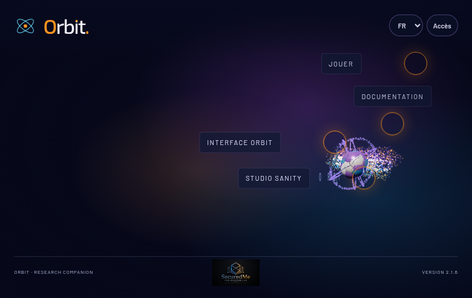{width=85%}

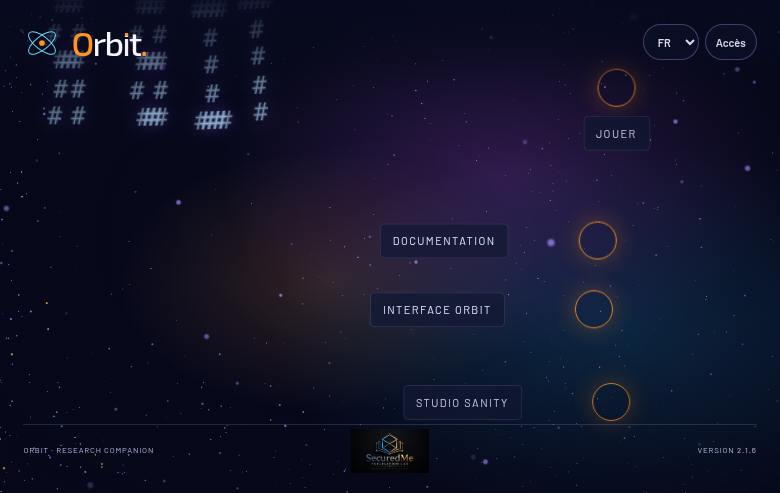{width=85%}

Dans le catalogue, chaque mode examine une seule idée. Choisir un jeu nettoie son stock de travail, sauf Empreinte qui garde la composition visible pour la capturer. Les modes restent disponibles même si leurs mécanismes coexistent déjà sur le landing. Les liens de navigation se trouvent hors du canvas : le geste de retour ne les remplace pas.


## 5. Fronde — Position, vitesse et amortissement

**Geste.** Maintenez dans la scène, tirez la perle ambre, puis relâchez. La perle part vers le noyau et repousse visuellement les poussières.

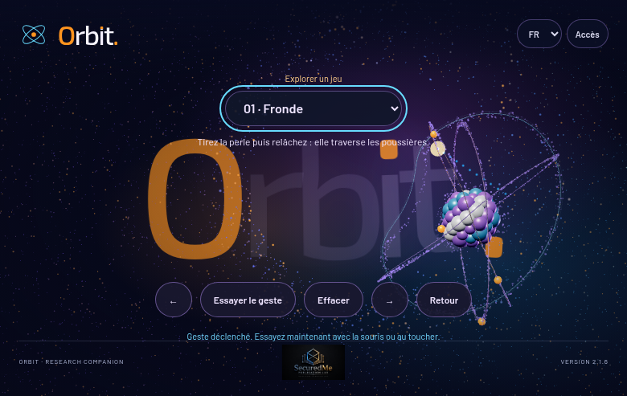

### Comprendre avant de calculer

Une position indique où se trouve la perle. Une vitesse indique comment cette position change. Le ressort imaginaire est le segment qui relie la perle au noyau : plus vous l'étirez, plus l'impulsion est grande, jusqu'au plafond prévu. Le ruban lumineux rend le trajet visible ; il ne calcule pas la trajectoire.

### Le mécanisme et un exemple

À la libération, v = 3(a − p), bornée à 8 unités de scène par seconde. a est la position du noyau, p celle de la perle. Ensuite p devient p + vΔt et v devient v exp(−0,55Δt). Δt est le temps écoulé, en secondes. Pour a=(0,0), p=(1,0), l'impulsion vaut (−3,0). Pendant 0,1 seconde, le déplacement initial est −0,3 unité ; l'amortissement réduit ensuite la vitesse à environ −2,84. Aux bords, la composante de vitesse est multipliée par −0,8.

### Retrouver le code

Extrait réel : `web/src/lib/atom-playground.ts`, ligne 191 dans l’instantané de cette édition. Les retours à la ligne ont été ajoutés après les points-virgules pour la lecture ; les instructions sont conservées. Retrouvez aussi le marqueur `slingVelocity.copy(atomPosition)` si les lignes ont changé.

```typescript
const release=(e:PointerEvent)=>{if(!active){ambientHolding=false;
vacuum=0;
if(c.canvas.hasPointerCapture(e.pointerId))c.canvas.releasePointerCapture(e.pointerId);
if(held){finishRewind();
if(c.canvas.hasPointerCapture(e.pointerId))c.canvas.releasePointerCapture(e.pointerId);
message('Parcours repris · un nouveau mouvement crée une nouvelle suite.');
c.schedule();
}return;
}
if(held&&mode==='sling'){slingVelocity.copy(atomPosition).sub(slingPosition).multiplyScalar(3).clampLength(0,8);
message('Fronde relâchée : direction vers le noyau.');
}
```

### Vérifier et comprendre la portée

La perle rebondit sur les bords du champ de caméra. Les poussières sont déformées par un shader : elles ne reçoivent pas une collision particule par particule. Cette fronde est une illustration, pas un simulateur balistique calibré.

La validation cloud a contrôlé un signal de l’effet et l’absence de valeur non finie après un geste natif. La capture ci-dessus montre un état rendu. Cette combinaison protège un parcours précis ; votre essai manuel vérifie aussi la sensation et la compréhension du geste. Le bouton de démonstration constitue une aide, distincte d’une réalisation autonome.

### Exercice à faire dans une copie de développement

Remplacez le multiplicateur 3 par 2 dans une copie de développement. Prédisez l'effet pour le même étirement, puis comparez. Conservez le plafond de 8. Avant d’exécuter, écrivez votre prédiction. Après l’essai, relevez ce que vous avez observé et une limite. Les pistes de correction sont regroupées à la fin du manuel.


## 6. Pinceau — Buffer circulaire et durée de vie

**Geste.** Déplacez le noyau dans la scène : le trajet produit un ruban cyan. Utilisez le geste habituel de déplacement de l'atome, puis observez le ruban s'effacer.


### Comprendre avant de calculer

Le pinceau garde des positions déjà traversées. Chaque point dispose d'une réserve de visibilité appelée durée de vie. Le mouvement en crée de nouveaux, tandis que les anciens perdent progressivement leur opacité. Un stock fixe évite que le dessin consomme toujours plus de mémoire.

### Le mécanisme et un exemple

Le tableau contient 1 024 emplacements. emit écrit dans trailIndex, puis avance avec (trailIndex + 1) modulo 1 024. Chaque vie α diminue de 0,22Δt jusqu'à zéro. Un point de vie initiale 1 peut donc rester actif environ 4,55 secondes à cadence temporelle normale. Trois points sont émis par frame lorsque le pointeur est tenu ou que la vitesse du noyau dépasse 0,1. Le nombre émis par seconde dépend donc encore de la fréquence de rendu.

### Retrouver le code

Extrait réel : `web/src/lib/atom-playground.ts`, ligne 93 dans l’instantané de cette édition. Les retours à la ligne ont été ajoutés après les points-virgules pour la lecture ; les instructions sont conservées. Retrouvez aussi le marqueur `function emit(p:` si les lignes ont changé.

```typescript
function emit(p:THREE.Vector3,life=1){p.toArray(trailArray,trailIndex*3);
trailAlpha[trailIndex]=life;
trailIndex=(trailIndex+1)%trailSize;
}
```

### Vérifier et comprendre la portée

Le bouton Essayer trace un cercle de démonstration. Il ne remplace pas votre parcours. Ce pinceau ne conserve pas le dessin après rechargement. L'émission par frame peut donner une densité différente selon la machine.

La validation cloud a contrôlé un signal de l’effet et l’absence de valeur non finie après un geste natif. La capture ci-dessus montre un état rendu. Cette combinaison protège un parcours précis ; votre essai manuel vérifie aussi la sensation et la compréhension du geste. Le bouton de démonstration constitue une aide, distincte d’une réalisation autonome.

### Exercice à faire dans une copie de développement

Changez le coefficient d'extinction de 0,22 à 0,44. Préparez deux captures à temps comparable et décrivez ce qui change. La capacité du stock reste 1 024. Avant d’exécuter, écrivez votre prédiction. Après l’essai, relevez ce que vous avez observé et une limite. Les pistes de correction sont regroupées à la fin du manuel.


## 7. Cordes — Onde et amplitude

**Geste.** Maintenez puis tirez dans la scène pour exciter les orbites. Relâchez et observez les vibrations diminuer.

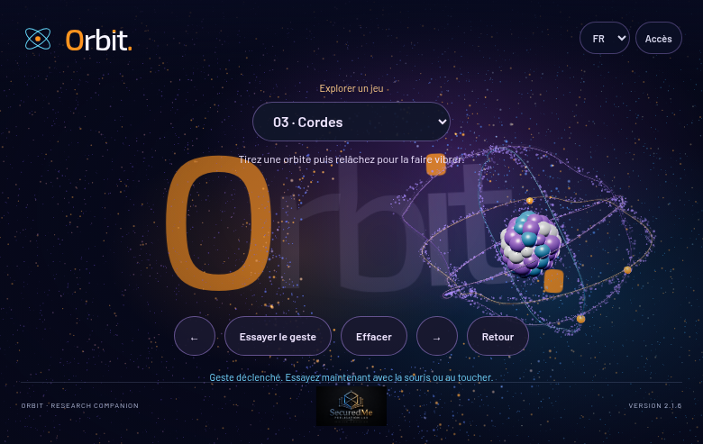

### Comprendre avant de calculer

Une corde peut onduler alors que son tracé moyen reste en place. Ici, l'orbite reçoit un décalage périodique. L'étirement du geste augmente l'amplitude ; le temps déplace les crêtes. Séparer ces deux effets évite de confondre intensité et fréquence.

### Le mécanisme et un exemple

Le décalage vaut 0,12r sin(5θ − 8t) exp(−0,1|z|). θ est l'angle d'un point de l'orbite, t le temps de scène et r la force du geste, bornée à 1,5. Le facteur 5 règle le nombre de variations angulaires ; 8 règle la progression temporelle. Après libération, r est multiplié par exp(−1,4Δt). Après une seconde, il reste environ 25 % de l'amplitude initiale.

### Retrouver le code

Extrait réel : `web/src/lib/atom-playground.ts`, ligne 254 dans l’instantané de cette édition. Les retours à la ligne ont été ajoutés après les points-virgules pour la lecture ; les instructions sont conservées. Retrouvez aussi le marqueur `ringOffset:` si les lignes ont changé.

```typescript
ringOffset:(x:number,y:number,z:number)=>active&&mode==='strings'?Math.sin(Math.atan2(y,x)*5-age*8)*ripple*Math.exp(-Math.abs(z)*.1)*.12:0,
```

### Vérifier et comprendre la portée

Le geste excite l'ensemble des orbites ; il ne sélectionne pas une corde précise par collision. Les lignes ne sont pas un réseau de masses reliées par des ressorts. L'onde est ajoutée au tracé existant.

La validation cloud a contrôlé un signal de l’effet et l’absence de valeur non finie après un geste natif. La capture ci-dessus montre un état rendu. Cette combinaison protège un parcours précis ; votre essai manuel vérifie aussi la sensation et la compréhension du geste. Le bouton de démonstration constitue une aide, distincte d’une réalisation autonome.

### Exercice à faire dans une copie de développement

Comparez le facteur angulaire 5 avec 3 en gardant 8 et 0,12. Dessinez les crêtes attendues avant la modification. Avant d’exécuter, écrivez votre prédiction. Après l’essai, relevez ce que vous avez observé et une limite. Les pistes de correction sont regroupées à la fin du manuel.


## 8. Élastique — Ressort amorti et déformation localisée

**Geste.** Pressez puis tirez dans la scène. Le noyau se déforme localement ; relâchez pour voir son retour.

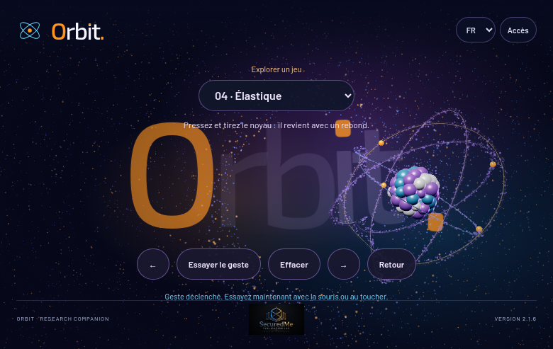

### Comprendre avant de calculer

La déformation possède une position et une vitesse de retour. Une force attire cette position vers le repos, tandis qu'un amortissement calme les rebonds. Les pièces proches de la direction du geste bougent davantage que les pièces éloignées.

### Le mécanisme et un exemple

Avec s la déformation et w sa vitesse, le code avance w de (−18s − 4w)Δt, puis s de wΔt. Le geste borne s à 0,8. Chaque pièce reçoit ensuite une fraction de s pondérée par exp(−4d²), où d mesure sa distance à une zone de référence. Si s=0,5 et w=0, avec Δt=0,016, la première variation de vitesse vaut −0,144 ; le déplacement s diminue ensuite d'environ 0,0023.

### Retrouver le code

Extrait réel : `web/src/lib/atom-playground.ts`, ligne 221 dans l’instantané de cette édition. Les retours à la ligne ont été ajoutés après les points-virgules pour la lecture ; les instructions sont conservées. Retrouvez aussi le marqueur `springV+=` si les lignes ont changé.

```typescript
if(mode==='elastic'&&!held&&moving){springV+=(-18*spring-4*springV)*dt;
spring+=springV*dt;
}
```

### Vérifier et comprendre la portée

Les pièces du noyau se déplacent ; aucun corps mou continu n'est calculé. Les coefficients expriment une réponse visuelle, pas une rigidité mesurée d'un matériau. Le mouvement réduit limite l'évolution automatique.

La validation cloud a contrôlé un signal de l’effet et l’absence de valeur non finie après un geste natif. La capture ci-dessus montre un état rendu. Cette combinaison protège un parcours précis ; votre essai manuel vérifie aussi la sensation et la compréhension du geste. Le bouton de démonstration constitue une aide, distincte d’une réalisation autonome.

### Exercice à faire dans une copie de développement

Passez l'amortissement de 4 à 6 en conservant 18. Comparez les rebonds. Revenez à 4 avant une autre expérience. Avant d’exécuter, écrivez votre prédiction. Après l’essai, relevez ce que vous avez observé et une limite. Les pistes de correction sont regroupées à la fin du manuel.


## 9. Vortex — Champ spatial et interpolation

**Geste.** C'est le jeu sélectionné à l'ouverture. Maintenez puis dessinez un cercle pour déplacer le centre du tourbillon ; relâchez pour le laisser décroître.

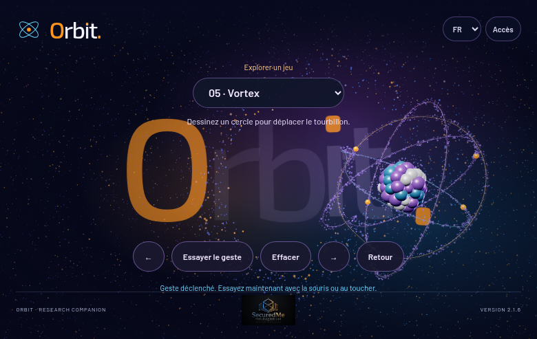

### Comprendre avant de calculer

Un champ décrit une action différente selon l'endroit. Les poussières proches du centre sont davantage tournées que les poussières éloignées. Le centre suit votre geste avec un léger retard pour que son déplacement reste doux.

### Le mécanisme et un exemple

vortex.lerp(pointer,0.15) rapproche le centre de 15 % de l'écart à chaque événement de déplacement. Pour un centre à 0 et une cible à 2, le premier pas donne 0,3. Dans le shader, l'influence vaut exp(−d²/5) multipliée par strength. Un angle sin(0,8t) × influence × 2,4 tourne les positions autour du centre. Après libération, strength est amortie par exp(−0,07Δt). Cette décroissance est lente : après dix secondes, il reste environ la moitié.

### Retrouver le code

Extrait réel : `web/src/lib/atom-playground.ts`, ligne 183 dans l’instantané de cette édition. Les retours à la ligne ont été ajoutés après les points-virgules pour la lecture ; les instructions sont conservées. Retrouvez aussi le marqueur `vortex.lerp(pointer` si les lignes ont changé.

```typescript
c.canvas.addEventListener('pointermove',e=>{point(e);
if(!active){if(starStarted<0)vortex.lerp(pointer,.15);
strength=1;
if(held)e.stopImmediatePropagation();
c.schedule();
return;
}
if(held){
```

### Vérifier et comprendre la portée

Les positions de base des poussières restent dans leur buffer ; le shader produit leur déplacement visuel. La rotation est périodique et peut changer de sens. Il ne s'agit pas d'une simulation de fluide. Le lissage dépend du nombre d'événements du pointeur.

La validation cloud a contrôlé un signal de l’effet et l’absence de valeur non finie après un geste natif. La capture ci-dessus montre un état rendu. Cette combinaison protège un parcours précis ; votre essai manuel vérifie aussi la sensation et la compréhension du geste. Le bouton de démonstration constitue une aide, distincte d’une réalisation autonome.

### Exercice à faire dans une copie de développement

Comparez une interpolation 0,15 avec 0,4 pour un même mouvement. Distinguez la réaction du centre et la décroissance de force. Avant d’exécuter, écrivez votre prédiction. Après l’essai, relevez ce que vous avez observé et une limite. Les pistes de correction sont regroupées à la fin du manuel.


## 10. Sculpter Orbit — Échantillonnage et positions de repos

**Geste.** Déplacez l'atome à travers les lettres du fond. En mode Sculpter Orbit, ces lettres sont de vrais points Three.js qui se déforment puis retrouvent leur tracé.

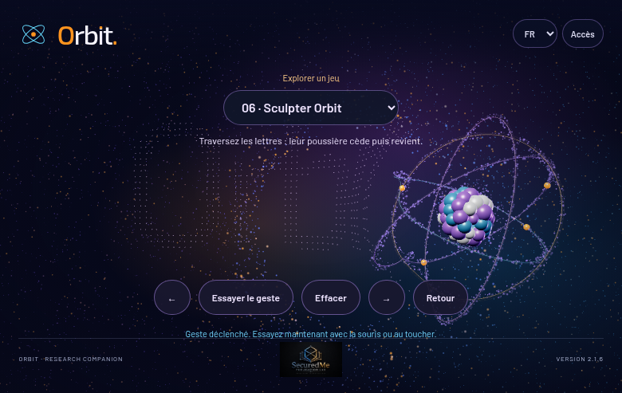

### Comprendre avant de calculer

Pour créer des lettres en particules, le programme commence par dessiner leurs caractères sur un canvas invisible. Il lit ensuite quelques pixels opaques et place un point à chacun de ces endroits. Chaque point possède une adresse de repos : la forme peut céder tout en restant reconnaissable.

### Le mécanisme et un exemple

Le code échantillonne tous les sept pixels et garde les pixels dont l'alpha dépasse 80. Les positions sont converties du rectangle de l'écran vers le plan de scène. La force locale comporte exp(−d²/1,2) × 0,9 ; une impulsion de démonstration ajoute 0,6 exp(−1,8t). Le point est repoussé dans la direction qui l'éloigne du noyau. Une fois le noyau loin, sa position calculée redevient proche de sa position de repos.

### Retrouver le code

Extrait réel : `web/src/lib/atom-playground.ts`, ligne 232 dans l’instantané de cette édition. Les retours à la ligne ont été ajoutés après les points-virgules pour la lecture ; les instructions sont conservées. Retrouvez aussi le marqueur `logoPositions[i]=` si les lignes ont changé.

```typescript
if(mode==='logo'){buildLogo();
if(logoAge>=0)logoAge+=dt;
for(let i=0;
i<logoPositions.length;
i+=3){const dx=logoHomes[i]-atomPosition.x,dy=logoHomes[i+1]-atomPosition.y,d=Math.hypot(dx,dy)||1;
const force=Math.exp(-d*d/1.2)*.9+(logoAge>=0?Math.exp(-logoAge*1.8)*.6:0);
logoPositions[i]=logoHomes[i]+dx/d*force;
logoPositions[i+1]=logoHomes[i+1]+dy/d*force;
logoPositions[i+2]=Math.sin(i+age)*force*.15;
}logoGeometry.attributes.position.needsUpdate=true;
}
```

### Vérifier et comprendre la portée

La reconstruction est recalculée quand les dimensions changent. La lisibilité dépend de la police chargée et de la taille de l'écran. Le retour est calculé à partir de la distance et de l'impulsion ; ce n'est pas un ressort individuel pour chaque lettre.

La validation cloud a contrôlé un signal de l’effet et l’absence de valeur non finie après un geste natif. La capture ci-dessus montre un état rendu. Cette combinaison protège un parcours précis ; votre essai manuel vérifie aussi la sensation et la compréhension du geste. Le bouton de démonstration constitue une aide, distincte d’une réalisation autonome.

### Exercice à faire dans une copie de développement

Comparez un pas d'échantillonnage de 7 puis de 10. Observez lisibilité et nombre de points ; restaurez 7 avant d'étudier la force. Avant d’exécuter, écrivez votre prédiction. Après l’essai, relevez ce que vous avez observé et une limite. Les pistes de correction sont regroupées à la fin du manuel.


## 11. Constellation — Collection bornée et sélection de proximité

**Geste.** Touchez ou cliquez le fond pour ajouter une étoile. Attrapez une étoile proche pour la déplacer. Les étoiles se relient dans leur ordre d'ajout.

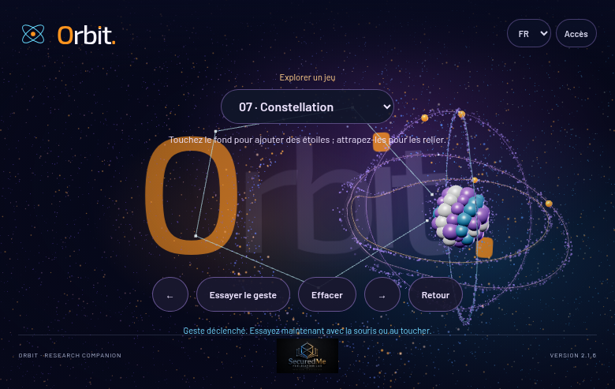

### Comprendre avant de calculer

Une constellation est une liste de positions. L'utilisateur crée les éléments et le programme dessine une ligne entre eux. Pour savoir si vous attrapez une étoile existante, le code mesure la distance entre le pointeur et chaque position.

### Le mécanisme et un exemple

Une étoile est sélectionnée si sa distance au pointeur est inférieure à 0,25 unité de scène. Si aucune n'est trouvée, une nouvelle est créée, jusqu'à 32. Les tableaux graphiques sont préalloués. setDrawRange montre seulement le nombre d'éléments présents. Le tracé relie la liste en séquence : A, puis B, puis C. Ce choix exprime l'ordre de construction, pas une relation scientifique.

### Retrouver le code

Extrait réel : `web/src/lib/atom-playground.ts`, ligne 178 dans l’instantané de cette édition. Les retours à la ligne ont été ajoutés après les points-virgules pour la lecture ; les instructions sont conservées. Retrouvez aussi le marqueur `picked=stars.findIndex` si les lignes ont changé.

```typescript
if(mode==='stars'){picked=stars.findIndex(p=>p.distanceTo(pointer)<.25);
if(picked<0&&stars.length<32){stars.push(pointer.clone());
picked=stars.length-1;
}message(`${stars.length} étoiles dans votre constellation.`);
}
```

### Vérifier et comprendre la portée

La première étoile de la liste située dans le rayon est choisie. Avec des points rapprochés, ce n'est pas toujours la plus proche. Les liens restent séquentiels, et la collection disparaît avec Effacer ou un changement de jeu.

La validation cloud a contrôlé un signal de l’effet et l’absence de valeur non finie après un geste natif. La capture ci-dessus montre un état rendu. Cette combinaison protège un parcours précis ; votre essai manuel vérifie aussi la sensation et la compréhension du geste. Le bouton de démonstration constitue une aide, distincte d’une réalisation autonome.

### Exercice à faire dans une copie de développement

Changez le rayon de sélection de 0,25 à 0,35. Prédisez l'effet lorsque deux étoiles sont proches. Gardez la borne de 32. Avant d’exécuter, écrivez votre prédiction. Après l’essai, relevez ce que vous avez observé et une limite. Les pistes de correction sont regroupées à la fin du manuel.


## 12. Collection — Accumulation, capacité et libération

**Geste.** Maintenez le fond pour faire grandir une couronne ambre autour du noyau. Relâchez pour semer une trace de points.

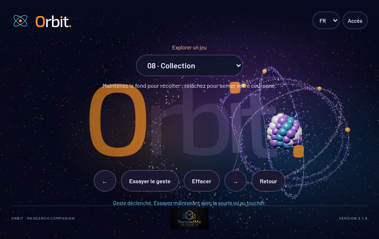

### Comprendre avant de calculer

Le maintien accumule une quantité. La libération change de phase : ce qui était rangé autour du noyau devient un motif semé. Un plafond empêche une accumulation infinie. Le vocabulaire de récolte décrit ici une expérience visuelle.

### Le mécanisme et un exemple

collecting augmente de 24Δt jusqu'à 128. Après deux secondes de maintien, la cible nominale est 48 points. Le rayon de couronne vaut 0,85 + 0,65 × seedFlash. À la libération, les points sont placés autour du noyau selon un pas angulaire 0,618 × 2π. Le shader rapproche aussi la poussière du centre. La couronne et la poussière utilisent des stocks distincts.

### Retrouver le code

Extrait réel : `web/src/lib/atom-playground.ts`, ligne 224 dans l’instantané de cette édition. Les retours à la ligne ont été ajoutés après les points-virgules pour la lecture ; les instructions sont conservées. Retrouvez aussi le marqueur `collecting=Math.min(128,collecting+dt*24)` si les lignes ont changé.

```typescript
if(mode==='collect'){if(held)collecting=Math.min(128,collecting+dt*24);
seedFlash=Math.max(0,seedFlash-dt*.4);
for(let i=0;
i<128;
i++){const a=i/128*Math.PI*2+age*.5,r=.85+seedFlash*.65;
new THREE.Vector3(atomPosition.x+Math.cos(a)*r,atomPosition.y+Math.sin(a)*r,Math.sin(a*3)*.15).toArray(crownArray,i*3);
}crownGeometry.setDrawRange(0,Math.floor(collecting));
crownGeometry.attributes.position.needsUpdate=true;
}
```

### Vérifier et comprendre la portée

Le programme ne retire pas une particule précise du fond à chaque récolte. Le compteur de la couronne est un état de jeu indépendant. Parler de conservation du nombre de poussières serait inexact.

La validation cloud a contrôlé un signal de l’effet et l’absence de valeur non finie après un geste natif. La capture ci-dessus montre un état rendu. Cette combinaison protège un parcours précis ; votre essai manuel vérifie aussi la sensation et la compréhension du geste. Le bouton de démonstration constitue une aide, distincte d’une réalisation autonome.

### Exercice à faire dans une copie de développement

Essayez une accumulation de 12Δt. Comparez le temps nécessaire pour atteindre une quantité donnée. Conservez le maximum 128. Avant d’exécuter, écrivez votre prédiction. Après l’essai, relevez ce que vous avez observé et une limite. Les pistes de correction sont regroupées à la fin du manuel.


## 13. Rosaces — Coordonnées polaires et paramètres

**Geste.** Tournez le noyau : la rotation change la fleur lumineuse tracée autour de lui.

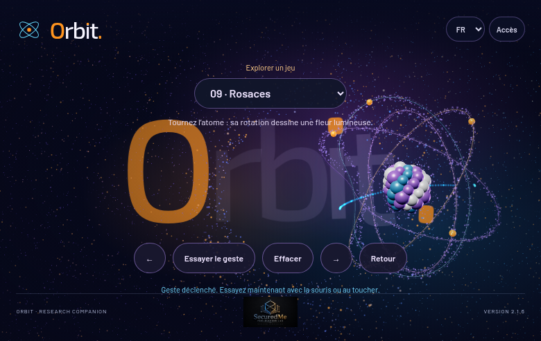

### Comprendre avant de calculer

Un point peut être décrit par un angle et une distance au centre. Si la distance varie régulièrement pendant que l'angle tourne, le point dessine une fleur. Votre rotation modifie le motif ; le rendu émet les points qui rendent ce motif visible.

### Le mécanisme et un exemple

Le rayon vaut 1,25 cos(ka + y), où a est l'angle progressif, y la rotation horizontale du noyau et k = 3 + round(2|x|), x étant son autre rotation. Les coordonnées deviennent r cos(a) et r sin(a). À a=0, y=0, r vaut 1,25 ; si ka+y vaut π/2, r est nul. Un rayon négatif place le point de l'autre côté du centre. Les six émissions par frame ont de petits décalages d'angle.

### Retrouver le code

Extrait réel : `web/src/lib/atom-playground.ts`, ligne 225 dans l’instantané de cette édition. Les retours à la ligne ont été ajoutés après les points-virgules pour la lecture ; les instructions sont conservées. Retrouvez aussi le marqueur `petals=3+` si les lignes ont changé.

```typescript
if(mode==='rosette'){const rotation=c.rotation();
for(let i=0;
i<6;
i++){const a=age*.6+i/6*.03,petals=3+Math.round(Math.abs(rotation.x)*2),r=1.25*Math.cos(petals*a+rotation.y);
emit(atomPosition.clone().add(new THREE.Vector3(Math.cos(a)*r,Math.sin(a)*r,.1)),.8);
}}
```

### Vérifier et comprendre la portée

La valeur k participe au nombre de pétales, mais les roses polaires ont des propriétés différentes pour les entiers pairs et impairs. Le nom de variable petals n'est pas une preuve que k égale toujours le nombre visuel de pétales. L'émission reste liée aux frames.

La validation cloud a contrôlé un signal de l’effet et l’absence de valeur non finie après un geste natif. La capture ci-dessus montre un état rendu. Cette combinaison protège un parcours précis ; votre essai manuel vérifie aussi la sensation et la compréhension du geste. Le bouton de démonstration constitue une aide, distincte d’une réalisation autonome.

### Exercice à faire dans une copie de développement

Changez l'amplitude 1,25 à 0,9. Gardez k inchangé pour comparer la taille seule. Avant d’exécuter, écrivez votre prédiction. Après l’essai, relevez ce que vous avez observé et une limite. Les pistes de correction sont regroupées à la fin du manuel.


## 14. Portails — Changement de position et anti-rebond

**Geste.** Déplacez le noyau vers le centre d'un anneau. Il ressort par l'autre, accompagné d'un trajet lumineux.

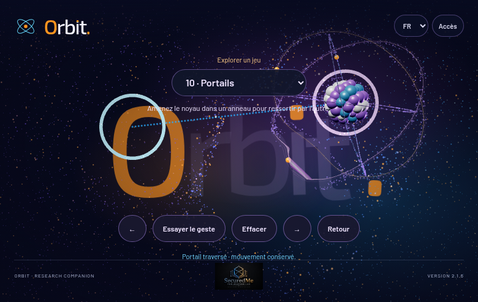

### Comprendre avant de calculer

Un portail change immédiatement la position, puis laisse le mouvement se poursuivre. Sans délai, le noyau arrivé dans le second anneau pourrait immédiatement revenir dans le premier. Une courte période de repos évite cette boucle.

### Le mécanisme et un exemple

L'entrée est détectée à moins de 0,5 unité du centre d'un portail. Le déplacement ajouté vaut destination − origine. Avec les centres (−2,2 ; 0,5) et (2,2 ; 1), le transfert ajoute (4,4 ; 0,5). La vitesse existante n'est pas réécrite. cooldown devient 1,3 seconde ; une nouvelle traversée attend son retour à zéro. Soixante-dix points marquent le lien entre les centres.

### Retrouver le code

Extrait réel : `web/src/lib/atom-playground.ts`, ligne 226 dans l’instantané de cette édition. Les retours à la ligne ont été ajoutés après les points-virgules pour la lecture ; les instructions sont conservées. Retrouvez aussi le marqueur `portalCrossings++;cooldown=1.3` si les lignes ont changé.

```typescript
if(mode==='portals'&&cooldown===0){const index=[portalA,portalB].findIndex(p=>p.distanceTo(atomPosition)<.5);
if(index>=0){const from=index===0?portalA:portalB,to=index===0?portalB:portalA;
c.flight.add(new THREE.Vector2(to.x-from.x,to.y-from.y));
portalCrossings++;
cooldown=1.3;
for(let i=0;
i<70;
i++)emit(from.clone().lerp(to,i/69));
message('Portail traversé · mouvement conservé.');
}}
```

### Vérifier et comprendre la portée

Le seuil porte sur la distance des centres, pas sur une collision exacte avec le tore. Aucun passage topologique ou relativiste n'est simulé. Les positions sont fixes et la vitesse est conservée par choix d'animation.

La validation cloud a contrôlé un signal de l’effet et l’absence de valeur non finie après un geste natif. La capture ci-dessus montre un état rendu. Cette combinaison protège un parcours précis ; votre essai manuel vérifie aussi la sensation et la compréhension du geste. Le bouton de démonstration constitue une aide, distincte d’une réalisation autonome.

### Exercice à faire dans une copie de développement

Réglez le délai à 2 secondes. Comparez la possibilité de retourner immédiatement dans l'autre sens, puis restaurez 1,3. Avant d’exécuter, écrivez votre prédiction. Après l’essai, relevez ce que vous avez observé et une limite. Les pistes de correction sont regroupées à la fin du manuel.


## 15. Puzzle — Erreur, tolérance et succès

**Geste.** Tournez le noyau pour aligner ses orbites avec les silhouettes ambre. Essayer le geste montre l'alignement assisté ; Effacer permet une tentative manuelle.

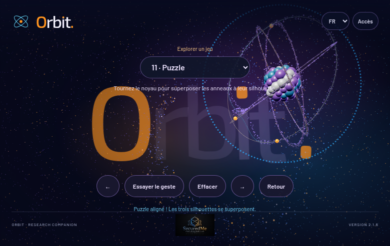

### Comprendre avant de calculer

Comparer exactement deux nombres flottants rendrait un jeu difficile. Le programme mesure plutôt un écart et accepte une petite zone de réussite. L'angle d'un cercle exige aussi de reconnaître que deux tours complets ramènent au même endroit.

### Le mécanisme et un exemple

La cible est x=0,35 radian, y=0,7 radian. L'erreur combine la différence de x et la différence angulaire de y : hypot(Δx, atan2(sin(Δy),cos(Δy))). Le succès est déclenché si cette norme est inférieure à 0,12. À Δx=0,06 et Δy=0,08, la norme vaut 0,10 : la condition est satisfaite. Un drapeau puzzleSolved évite de répéter le message à chaque frame.

### Retrouver le code

Extrait réel : `web/src/lib/atom-playground.ts`, ligne 227 dans l’instantané de cette édition. Les retours à la ligne ont été ajoutés après les points-virgules pour la lecture ; les instructions sont conservées. Retrouvez aussi le marqueur `error=Math.hypot` si les lignes ont changé.

```typescript
if(mode==='puzzle'){puzzle.position.copy(atomPosition);
puzzle.scale.copy(c.atom.scale);
puzzle.rotation.set(targetX,targetY,-.1);
const rot=c.rotation(),error=Math.hypot(rot.x-targetX,Math.atan2(Math.sin(rot.y-targetY),Math.cos(rot.y-targetY)));
if(error<.12&&!puzzleSolved){puzzleSolved=true;
message('Puzzle aligné ! Les trois silhouettes se superposent.');
for(let i=0;
i<160;
i++){const a=i/160*Math.PI*2;
emit(atomPosition.clone().add(new THREE.Vector3(Math.cos(a)*2,Math.sin(a)*2,0)));
}}}
```

### Vérifier et comprendre la portée

Le bouton de démonstration règle la rotation cible : ce n'est pas la preuve que l'apprenant a réussi seul. L'alignement porte sur deux paramètres ; la profondeur reste déterminée par le rendu existant.

La validation cloud a contrôlé un signal de l’effet et l’absence de valeur non finie après un geste natif. La capture ci-dessus montre un état rendu. Cette combinaison protège un parcours précis ; votre essai manuel vérifie aussi la sensation et la compréhension du geste. Le bouton de démonstration constitue une aide, distincte d’une réalisation autonome.

### Exercice à faire dans une copie de développement

Essayez une tolérance de 0,08 puis 0,16. Distinguez difficulté de manipulation et correction géométrique du puzzle. Avant d’exécuter, écrivez votre prédiction. Après l’essai, relevez ce que vous avez observé et une limite. Les pistes de correction sont regroupées à la fin du manuel.


## 16. Écho — Historique horodaté et retard

**Geste.** Déplacez l'atome. Une copie pâle rejoue un état récent de son parcours avec un retard visé de 1,5 seconde.

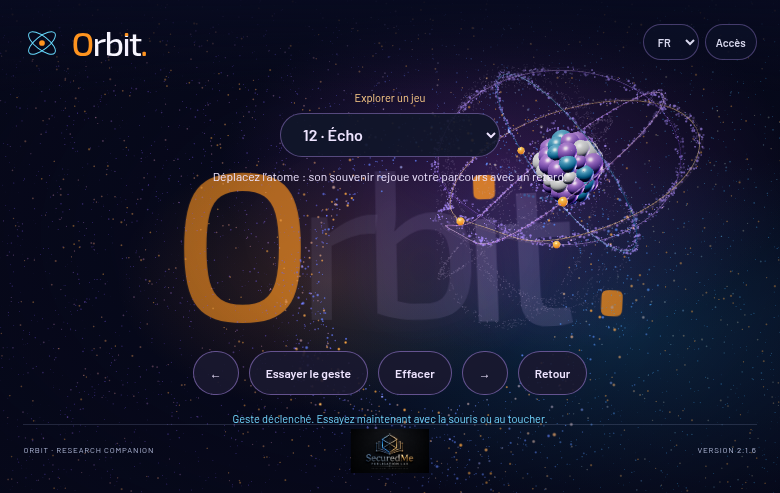

### Comprendre avant de calculer

Une copie immédiate suivrait chaque mouvement. Un écho consulte des états plus anciens. Il faut donc conserver positions, rotations et temps, puis choisir une entrée située près du temps demandé.

### Le mécanisme et un exemple

Chaque frame mobile ajoute un instantané ; la file conserve au maximum 240 entrées. Le fantôme prend la première entrée dont le temps est au moins age − 1,5. La cadence et la durée réellement disponibles dépendent du rendu. À 60 frames par seconde, 240 entrées représentent environ quatre secondes. Le matériau du fantôme a une opacité de 0,15.

### Retrouver le code

Extrait réel : `web/src/lib/atom-playground.ts`, ligne 229 dans l’instantané de cette édition. Les retours à la ligne ont été ajoutés après les points-virgules pour la lecture ; les instructions sont conservées. Retrouvez aussi le marqueur `histories.find(h=>h.time>=age-1.5)` si les lignes ont changé.

```typescript
if(mode==='echo'){const entry=histories.find(h=>h.time>=age-1.5);
ghost.visible=!!entry;
if(entry){ghost.position.copy(entry.position);
ghost.rotation.set(entry.x,entry.y,-.1);
ghost.scale.copy(c.atom.scale);
if(moving)emit(entry.position,.3);
}}
```

### Vérifier et comprendre la portée

Le début de jeu n'a pas encore tout l'historique nécessaire. L'entrée est choisie parmi des échantillons, sans interpolation temporelle fine. La démonstration peut fabriquer un parcours explicatif ; votre geste constitue un parcours différent. Le souvenir est une silhouette de points ; il ne copie pas toutes les sphères éclairées et reste absent du landing par défaut.

La validation cloud a contrôlé un signal de l’effet et l’absence de valeur non finie après un geste natif. La capture ci-dessus montre un état rendu. Cette combinaison protège un parcours précis ; votre essai manuel vérifie aussi la sensation et la compréhension du geste. Le bouton de démonstration constitue une aide, distincte d’une réalisation autonome.

### Exercice à faire dans une copie de développement

Changez 1,5 en 0,75. Préparez un trajet avec un arrêt net et comparez le décalage, en conservant 240 entrées. Avant d’exécuter, écrivez votre prédiction. Après l’essai, relevez ce que vous avez observé et une limite. Les pistes de correction sont regroupées à la fin du manuel.


## 17. Remonter le temps — Instantanés, restauration et branche d'historique

**Geste.** Créez un parcours, puis maintenez sur le fond, loin du noyau, pour rembobiner. Relâchez et créez un nouveau trajet à partir de l'état retrouvé.

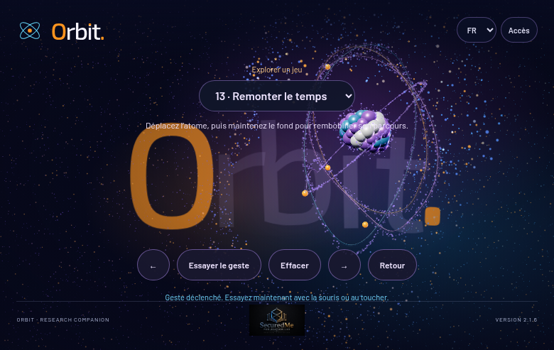

### Comprendre avant de calculer

Le retour dans le temps d'une interface consiste à restaurer des données enregistrées. Il ne remonte pas le temps réel : il relit une suite de positions et de traces. Après un retour, un nouveau geste forme une nouvelle branche et l'ancien futur est retiré.

### Le mécanisme et un exemple

L'historique garde position, rotation, temps de scène, tableau de positions du ruban et vies des points. rewindIndex part de la dernière entrée, puis diminue de 60Δt. L'évaluation restaure les tableaux, remet la vitesse à zéro et ajuste le déplacement. À la libération, splice retire les entrées situées après la position courante. Les 240 instantanés sont une borne en nombre, pas en secondes.

### Retrouver le code

Extrait réel : `web/src/lib/atom-playground.ts`, ligne 171 dans l’instantané de cette édition. Les retours à la ligne ont été ajoutés après les points-virgules pour la lecture ; les instructions sont conservées. Retrouvez aussi le marqueur `histories.splice(Math.max` si les lignes ont changé.

```typescript
function finishRewind(){if(rewindIndex>=0)histories.splice(Math.max(0,Math.floor(rewindIndex)+1));
rewindIndex=-1;
held=false;
}
```

### Vérifier et comprendre la portée

Le retour restaure les données prévues pour ce mode, pas l'intégralité de la scène, des menus ou du navigateur. La poussière et les gestes futurs ne forment pas un moteur général d'annulation. Les copies de tableaux rendent ce mode plus gourmand que l'écho simple.

La validation cloud a contrôlé un signal de l’effet et l’absence de valeur non finie après un geste natif. La capture ci-dessus montre un état rendu. Cette combinaison protège un parcours précis ; votre essai manuel vérifie aussi la sensation et la compréhension du geste. Le bouton de démonstration constitue une aide, distincte d’une réalisation autonome.

### Exercice à faire dans une copie de développement

Comparez une vitesse de lecture de 60Δt et 30Δt. Décrivez la durée du retour pour un même historique. Avant d’exécuter, écrivez votre prédiction. Après l’essai, relevez ce que vous avez observé et une limite. Les pistes de correction sont regroupées à la fin du manuel.


## 18. Rencontre — Distance et relation visuelle

**Geste.** Approchez le noyau du petit compagnon. Une tresse lumineuse relie les deux, et deux flux parcourent la liaison.

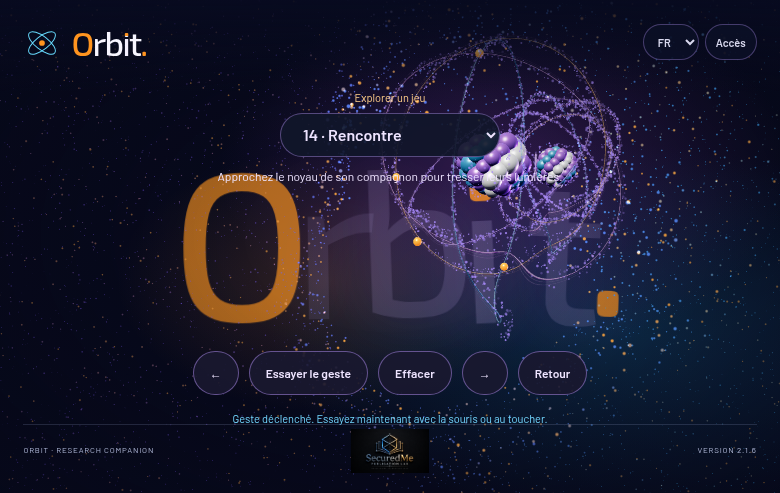

### Comprendre avant de calculer

La présence d'une liaison dépend de la proximité. La tresse n'a pas besoin d'être un objet rigide : elle peut être reconstruite à partir de positions entre deux extrémités. Un motif sinusoïdal lui donne son apparence.

### Le mécanisme et un exemple

connection = max(0,1 − distance/4). À deux unités de distance, la valeur est 0,5 ; au-delà de quatre, elle vaut zéro. Les 96 points de la ligne interpolent entre les deux atomes ; des sinus et cosinus ajoutent un décalage de 0,22 × connection. Des particules traversent dans les deux sens si connection dépasse 0,5. Le compagnon mesure 40 % de l'échelle de référence du clone.

### Retrouver le code

Extrait réel : `web/src/lib/atom-playground.ts`, ligne 231 dans l’instantané de cette édition. Les retours à la ligne ont été ajoutés après les points-virgules pour la lecture ; les instructions sont conservées. Retrouvez aussi le marqueur `connection=Math.max(0,1-distance/4)` si les lignes ont changé.

```typescript
if(mode==='duet'){duet.rotation.set(c.atom.rotation.x,-c.atom.rotation.y,0);
const distance=atomPosition.distanceTo(duetPosition);
const connection=Math.max(0,1-distance/4);
braid.visible=connection>.01;
for(let i=0;
i<96;
i++){const t=i/95,p=atomPosition.clone().lerp(duetPosition,t);
p.y+=Math.sin(t*Math.PI*12+age*3)*.22*connection;
p.z+=Math.cos(t*Math.PI*12+age*3)*.22*connection;
p.toArray(braidArray,i*3);
}braidGeometry.attributes.position.needsUpdate=true;
if(moving&&connection>.5){const t=(age*.45)%1;
emit(atomPosition.clone().lerp(duetPosition,t));
emit(duetPosition.clone().lerp(atomPosition,t));
}}
```

### Vérifier et comprendre la portée

Il s'agit d'une relation graphique déclenchée par la distance. Aucun échange de messages, transfert d'énergie ou synchronisation scientifique entre atomes n'est calculé. Le petit compagnon a une position fixe.

La validation cloud a contrôlé un signal de l’effet et l’absence de valeur non finie après un geste natif. La capture ci-dessus montre un état rendu. Cette combinaison protège un parcours précis ; votre essai manuel vérifie aussi la sensation et la compréhension du geste. Le bouton de démonstration constitue une aide, distincte d’une réalisation autonome.

### Exercice à faire dans une copie de développement

Changez le rayon de relation 4 en 3. Prédisez où la tresse disparaîtra. Gardez séparément le seuil d'émission de 0,5. Avant d’exécuter, écrivez votre prédiction. Après l’essai, relevez ce que vous avez observé et une limite. Les pistes de correction sont regroupées à la fin du manuel.


## 19. Empreinte — Composition d'image et export local

**Geste.** Composez votre scène, puis choisissez Empreinte et Enregistrer PNG. Le navigateur prépare une image à télécharger sur votre appareil.

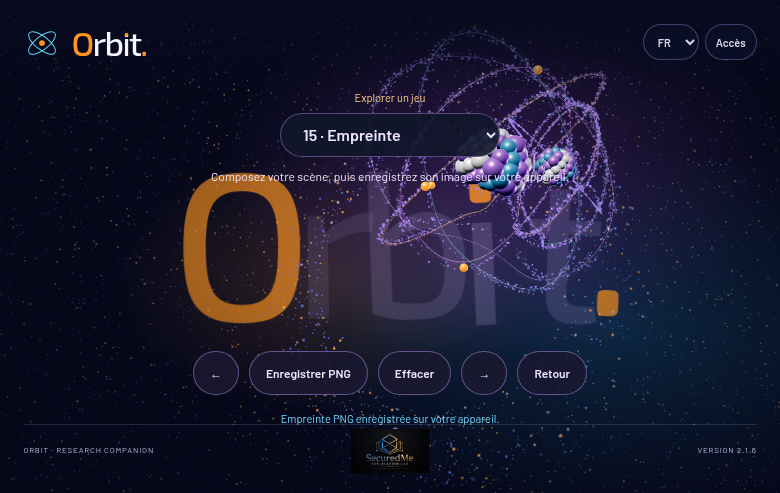

### Comprendre avant de calculer

La capture transforme une scène interactive en document fixe. Le programme dessine d'abord la scène, puis la copie sur un second canvas, ajoute le fond et le mot Orbit si nécessaire, et produit un fichier PNG.

### Le mécanisme et un exemple

renderer.render précède drawImage. Le canvas de sortie reprend les dimensions réelles du canvas WebGL. Son fond vaut #080b20 ; la mise à l'échelle permet d'ajouter les lettres selon leur position dans la page. toBlob produit le PNG de manière asynchrone. Une URL temporaire déclenche le téléchargement, puis URL.revokeObjectURL la libère après une seconde.

### Retrouver le code

Extrait réel : `web/src/lib/atom-playground.ts`, ligne 145 dans l’instantané de cette édition. Les retours à la ligne ont été ajoutés après les points-virgules pour la lecture ; les instructions sont conservées. Retrouvez aussi le marqueur `image.toBlob(blob=>` si les lignes ont changé.

```typescript
image.toBlob(blob=>{if(!blob){message('Capture indisponible. Réessayez.');
return;
}captures++;
c.scope.dataset.gameCaptures=String(captures);
const url=URL.createObjectURL(blob);
const link=document.createElement('a');
link.href=url;
link.download='orbit-empreinte.png';
link.click();
setTimeout(()=>URL.revokeObjectURL(url),1000);
message('Empreinte PNG enregistrée sur votre appareil.');
},'image/png');

```

### Vérifier et comprendre la portée

L'image représente la composition de scène, pas une capture intégrale des contrôles HTML. Le téléchargement peut dépendre des règles du navigateur. Un PNG conserve des pixels ; il ne permet pas de reprendre l'état interactif. Aucune image n'est envoyée à un serveur par ce jeu.

La validation cloud a contrôlé un signal de l’effet et l’absence de valeur non finie après un geste natif. La capture ci-dessus montre un état rendu. Cette combinaison protège un parcours précis ; votre essai manuel vérifie aussi la sensation et la compréhension du geste. Le bouton de démonstration constitue une aide, distincte d’une réalisation autonome.

### Exercice à faire dans une copie de développement

Remplacez seulement la légende ma constellation par un titre court de votre atelier. Vérifiez la lisibilité et restaurez la version du projet avant une livraison publique. Avant d’exécuter, écrivez votre prédiction. Après l’essai, relevez ce que vous avez observé et une limite. Les pistes de correction sont regroupées à la fin du manuel.


## 20. Rendre l’expérience fiable

Chaque jeu utilise un stock borné : 32 étoiles, 128 points de couronne, 1 024 points de ruban, 240 états d’historique, 96 points pour la tresse. Les limites sont des décisions de conception. Les jeux temporels conservent des tableaux de trace. Le landing n’enregistre aucun historique automatique. Les 55 sphères gardent leurs transformations indépendantes, mais sont dessinées par quatre groupes InstancedMesh de même matériau ; cela réduit les appels de dessin sans changer leur identité visuelle. Le jeu Écho utilise désormais une silhouette de points en une seule commande de dessin, au lieu d’une copie de tous les maillages éclairés. Une optimisation utile commence par observer allocations et temps de frame sur un appareil représentatif, pas par diminuer toutes les capacités arbitrairement.

Le playground possède son AbortController. Lors du nettoyage, il enlève ses événements et son panneau, retire son groupe de la scène, libère ses géométries propres et ses matériaux. Les clones partagent certaines géométries du noyau : ce partage doit être respecté pour ne pas détruire un objet encore utilisé. La scène principale arrête son rendu et libère ensuite ses ressources. Les contrôles cloud n’ont pas mesuré exhaustivement une fuite après cent transitions ; ce point reste un contrôle complémentaire possible.

Le menu Accès reste sombre et simple. Statique fige la scène actuelle ; les objets ne sont pas supprimés et le canvas reste visible. Reprendre réactive la même scène. Le contraste renforcé et le texte agrandi sont des préférences locales, conservées avec la langue FR/EN/ES sous un contrat commun versionné. Le nom Orbit. reste non traduisible ; le O majuscule, les points et le point du i utilisent l’accent orange. Le mouvement réduit du système bloque ou fige certaines animations automatiques et conserve les commandes de démonstration adaptées. La pause agit sur le temps du rendu. En cas de perte de contexte WebGL, la scène rend la navigation ordinaire et l’illustration statique accessibles. L’absence de WebGL signifie que les jeux 3D ne sont pas disponibles ; elle ne signifie pas que l’utilisateur est empêché d’ouvrir Orbit, Studio ou Documentation.

Sur petit écran, le sélecteur et les boutons restent dans une largeur disponible. Le contrôle automatique couvre un format de 390 × 844 pixels ; il ne remplace pas l’observation sur tous les appareils. Pour faire évoluer le code, changez un paramètre à la fois, gardez le geste comparable, notez les différences et restaurez la valeur avant une autre expérience.

## 21. Votre journal de compréhension

Complétez les lignes avec des observations datées. Une réponse que vous pouvez expliquer et transférer est plus utile qu’un score de jeu.

| Notion | Rencontrée dans | Mon essai | Ce que je peux expliquer | Nouvelle application |
|:---|:---|:---|:---|:---|
| Position / vitesse | Fronde, lancer | À compléter | À compléter | À compléter |
| Amortissement | Élastique, rebond | À compléter | À compléter | À compléter |
| Interpolation | Vortex, Rencontre | À compléter | À compléter | À compléter |
| Stock borné | Pinceau, Écho | À compléter | À compléter | À compléter |
| État / événement | Portails, retour | À compléter | À compléter | À compléter |
| Export | Empreinte | À compléter | À compléter | À compléter |

**Bilan à la première personne, à compléter :** « J’ai observé… Mon hypothèse était… Dans le code, le paramètre… Cette expérience montre… La limite de mon observation est… Pour vérifier mon explication, je peux essayer… »

# Partie II — apprendre à l’enseigner

## 22. Une méthode pour chaque rencontre

Commencez par un effet visible. Laissez l’étudiant prédire avant le clic ou la modification. Expliquez une idée, montrez le petit morceau de code qui la réalise, puis laissez une expérience réversible. Demandez une reformulation et une application nouvelle. Votre rôle consiste à organiser cette progression ; le logiciel n’observe pas automatiquement la compréhension.

Les activités suivantes sont des propositions à réaliser avec un étudiant. Les résultats attendus restent des pistes, pas des témoignages d’un atelier déjà effectué. Adaptez vocabulaire, nombres et durée à son aisance avec coordonnées et programmation. Un débutant peut travailler sur papier et dans le site ; un étudiant plus avancé peut modifier une copie de code. Le matériel est une machine avec navigateur, une feuille et un crayon. La ficelle de l’activité Cordes est facultative.

Pour chaque activité, consacrez environ deux minutes à montrer et prédire, trois à cinq minutes à expérimenter, puis deux minutes à expliquer et transférer. Cette durée est une estimation pédagogique, à ajuster à la personne. L’étudiant gagne du temps de réflexion ; l’enseignant évite de remplir immédiatement chaque silence.

## 23. Parler avec votre intention

Les scripts proposés gardent l’enthousiasme du projet : une expérience visible, une hypothèse, un essai et une explication reliée au code. Ils utilisent une première personne de démonstration, par exemple « Je vais essayer… » ou « Mon hypothèse est… ». Les pauses et intonations sont des indications de lecture. Aucun enregistrement de référence n’a servi à reproduire votre voix réelle.

**[Pause]** laisse le temps d’observer. **[Accent]** souligne la conséquence. **[Ralentir]** accompagne un terme nouveau. **[Énergie]** accompagne le geste, sans remplacer l’explication. Évitez d’annoncer « tu as compris » après un succès : demandez plutôt ce qui permettait de le prédire.


## Activité 01 — Le défi de la cible invisible

**Jeu : Fronde. Objectif :** Distinguer distance, direction et vitesse, en observant un geste identique deux fois.

**Préparation.** Ouvrez le jeu, utilisez Effacer lorsque c’est pertinent, puis faites un seul geste de démonstration. Expliquez que l’essai de l’étudiant vient ensuite. Préparez une feuille pour noter sa prédiction et son observation. Les modifications de code se font dans une copie réversible.

**Question avant l’action :** Si je tire à droite du noyau, dans quel sens la perle part-elle ? Un étirement deux fois plus grand donne-t-il toujours deux fois plus de vitesse ?

### Déroulement avec l’étudiant

1. Dessinez sur une feuille le noyau et deux positions de départ à droite. Faites tracer la flèche attendue avant de toucher l'écran.
2. L'étudiant tire peu, relâche, puis recommence avec un étirement plus grand. Il note le sens et la longueur visible du trajet, pas une vitesse prétendument mesurée.
3. Inversez les rôles : l'étudiant annonce un geste, vous prédisez le mouvement. Examinez ensemble le plafond et le rebond.
4. Dans la copie de code, essayez le coefficient 2. Comparez à l'hypothèse, puis restaurez 3.

### Une entrée orale proposée

« [Énergie] On va partir de quelque chose qu’on peut vraiment manipuler. [Pause] Mon hypothèse, je l’écris avant d’essayer. Pour fronde, si je tire à droite du noyau, dans quel sens la perle part-elle ? Un étirement deux fois plus grand donne-t-il toujours deux fois plus de vitesse ? [Ralentir] Après le geste, on cherchera la donnée du programme qui explique le résultat. Si notre observation diffère, on garde la différence : elle nous aide à trouver ce qu’on avait oublié. »

### Vérifier la compréhension

Demandez à l’étudiant de raconter le mécanisme sans lire le chapitre. Faites-lui nommer un paramètre, son rôle et une limite. Une bonne reformulation distingue ce qu’il a vu et ce qu’il suppose. Pour une vérification de transfert, demandez : **Comment utiliseriez-vous position et vitesse pour faire glisser une carte de jeu ?**

**Trace de l’atelier.** Prédiction : ______. Observation : ______. Explication de l’étudiant : ______. Ce qui reste à clarifier : ______. Date et version essayée : ______.


## Activité 02 — Le dessin qui s'oublie

**Jeu : Pinceau. Objectif :** Comprendre pourquoi une limite de mémoire peut être compatible avec une trace continue.

**Préparation.** Ouvrez le jeu, utilisez Effacer lorsque c’est pertinent, puis faites un seul geste de démonstration. Expliquez que l’essai de l’étudiant vient ensuite. Préparez une feuille pour noter sa prédiction et son observation. Les modifications de code se font dans une copie réversible.

**Question avant l’action :** Que devient le premier point si nous dessinons plus longtemps que la capacité du tableau ?

### Déroulement avec l’étudiant

1. Faites tracer un huit avec le noyau ; demandez à l'étudiant de désigner la partie la plus ancienne.
2. Attendez en observant la disparition, puis dessinez à nouveau. L'étudiant distingue création et extinction.
3. Sur une feuille, numérotez huit cases : écrivez une position dans chacune, puis revenez à la première. Ce petit modèle représente le buffer de 1 024 cases.
4. Modifiez seulement la vitesse d'extinction dans la copie de développement et comparez deux essais.

### Une entrée orale proposée

« [Énergie] On va partir de quelque chose qu’on peut vraiment manipuler. [Pause] Mon hypothèse, je l’écris avant d’essayer. Pour pinceau, que devient le premier point si nous dessinons plus longtemps que la capacité du tableau ? [Ralentir] Après le geste, on cherchera la donnée du programme qui explique le résultat. Si notre observation diffère, on garde la différence : elle nous aide à trouver ce qu’on avait oublié. »

### Vérifier la compréhension

Demandez à l’étudiant de raconter le mécanisme sans lire le chapitre. Faites-lui nommer un paramètre, son rôle et une limite. Une bonne reformulation distingue ce qu’il a vu et ce qu’il suppose. Pour une vérification de transfert, demandez : **Quel autre usage pourrait avoir un stock circulaire : historique de capteur, journal limité, dernières positions d'un personnage ?**

**Trace de l’atelier.** Prédiction : ______. Observation : ______. Explication de l’étudiant : ______. Ce qui reste à clarifier : ______. Date et version essayée : ______.


## Activité 03 — La corde humaine

**Jeu : Cordes. Objectif :** Séparer amplitude, motif spatial et évolution dans le temps.

**Préparation.** Ouvrez le jeu, utilisez Effacer lorsque c’est pertinent, puis faites un seul geste de démonstration. Expliquez que l’essai de l’étudiant vient ensuite. Préparez une feuille pour noter sa prédiction et son observation. Les modifications de code se font dans une copie réversible.

**Question avant l’action :** Si je tire plus loin, les bosses deviennent-elles plus hautes ou plus nombreuses ?

### Déroulement avec l’étudiant

1. Deux personnes tiennent une ficelle légère. Produisez une petite puis une grande ondulation, sans changer volontairement la cadence.
2. Reproduisez deux amplitudes de geste dans Orbit. L'étudiant dessine le motif immédiatement après libération.
3. Examinez les facteurs 0,12, 5 et 8 : associez chacun à hauteur, motif ou évolution.
4. Dans le code, modifiez uniquement 5 en 3. Comparez les crêtes à votre dessin, puis restaurez la valeur.

### Une entrée orale proposée

« [Énergie] On va partir de quelque chose qu’on peut vraiment manipuler. [Pause] Mon hypothèse, je l’écris avant d’essayer. Pour cordes, si je tire plus loin, les bosses deviennent-elles plus hautes ou plus nombreuses ? [Ralentir] Après le geste, on cherchera la donnée du programme qui explique le résultat. Si notre observation diffère, on garde la différence : elle nous aide à trouver ce qu’on avait oublié. »

### Vérifier la compréhension

Demandez à l’étudiant de raconter le mécanisme sans lire le chapitre. Faites-lui nommer un paramètre, son rôle et une limite. Une bonne reformulation distingue ce qu’il a vu et ce qu’il suppose. Pour une vérification de transfert, demandez : **Comment dessineriez-vous un drapeau qui ondule plus fort sans augmenter son nombre de plis ?**

**Trace de l’atelier.** Prédiction : ______. Observation : ______. Explication de l’étudiant : ______. Ce qui reste à clarifier : ______. Date et version essayée : ______.


## Activité 04 — Le retour tranquille

**Jeu : Élastique. Objectif :** Relier retour au repos et dissipation, sans confondre les deux coefficients.

**Préparation.** Ouvrez le jeu, utilisez Effacer lorsque c’est pertinent, puis faites un seul geste de démonstration. Expliquez que l’essai de l’étudiant vient ensuite. Préparez une feuille pour noter sa prédiction et son observation. Les modifications de code se font dans une copie réversible.

**Question avant l’action :** Quel coefficient modifier pour calmer le rebond tout en gardant la même attraction vers le repos ?

### Déroulement avec l’étudiant

1. Faites un étirement comparable deux fois. L'étudiant décrit ce qui revient et ce qui oscille.
2. Tracez trois cases sur papier : déformation, vitesse de retour, temps. Faites une seule étape numérique avec les valeurs du chapitre.
3. Essayez l'amortissement 6. L'étudiant observe le changement et compare à sa prédiction.
4. Il explique la différence entre un retour rapide, un rebond et une disparition instantanée.

### Une entrée orale proposée

« [Énergie] On va partir de quelque chose qu’on peut vraiment manipuler. [Pause] Mon hypothèse, je l’écris avant d’essayer. Pour élastique, quel coefficient modifier pour calmer le rebond tout en gardant la même attraction vers le repos ? [Ralentir] Après le geste, on cherchera la donnée du programme qui explique le résultat. Si notre observation diffère, on garde la différence : elle nous aide à trouver ce qu’on avait oublié. »

### Vérifier la compréhension

Demandez à l’étudiant de raconter le mécanisme sans lire le chapitre. Faites-lui nommer un paramètre, son rôle et une limite. Une bonne reformulation distingue ce qu’il a vu et ce qu’il suppose. Pour une vérification de transfert, demandez : **Où utiliser un ressort amorti dans une interface : bouton, panneau, caméra ou curseur ?**

**Trace de l’atelier.** Prédiction : ______. Observation : ______. Explication de l’étudiant : ______. Ce qui reste à clarifier : ______. Date et version essayée : ______.


## Activité 05 — La carte du tourbillon

**Jeu : Vortex. Objectif :** Comprendre un effet local dont l'intensité dépend de la distance.

**Préparation.** Ouvrez le jeu, utilisez Effacer lorsque c’est pertinent, puis faites un seul geste de démonstration. Expliquez que l’essai de l’étudiant vient ensuite. Préparez une feuille pour noter sa prédiction et son observation. Les modifications de code se font dans une copie réversible.

**Question avant l’action :** La poussière située loin du centre devrait-elle tourner autant que celle située près ?

### Déroulement avec l’étudiant

1. Sur papier, dessinez trois cercles autour d'un centre. L'étudiant attribue qualitativement une influence forte, moyenne ou faible.
2. Dans Orbit, déplacez le centre lentement puis rapidement. Observez les zones les plus perturbées.
3. Calculez ensemble le premier pas d'interpolation de 0 vers 2. Faites ensuite un second pas : 0,3 + 0,15 × 1,7.
4. Essayez 0,4 dans la copie de code. L'étudiant compare le retard ressenti, puis explique la différence avec la force du tourbillon.
5. Sur le landing, chronométrez ensuite trois maintiens : 1,5 seconde, 2,8 secondes, 4,5 secondes puis 6,8 secondes. Prédisez le seuil d'aspiration celui du logo ASCII puis celui de l’explosion ; relâchez et vérifiez la recomposition. Recommencez en mode Statique pour expliquer le rôle d'une garde d'entrée.

### Une entrée orale proposée

« [Énergie] On va partir de quelque chose qu’on peut vraiment manipuler. [Pause] Mon hypothèse, je l’écris avant d’essayer. Pour vortex, la poussière située loin du centre devrait-elle tourner autant que celle située près ? [Ralentir] Après le geste, on cherchera la donnée du programme qui explique le résultat. Si notre observation diffère, on garde la différence : elle nous aide à trouver ce qu’on avait oublié. »

### Vérifier la compréhension

Demandez à l’étudiant de raconter le mécanisme sans lire le chapitre. Faites-lui nommer un paramètre, son rôle et une limite. Une bonne reformulation distingue ce qu’il a vu et ce qu’il suppose. Pour une vérification de transfert, demandez : **Comment faire suivre une caméra à un objet tout en conservant un retard contrôlé ?**

**Trace de l’atelier.** Prédiction : ______. Observation : ______. Explication de l’étudiant : ______. Ce qui reste à clarifier : ______. Date et version essayée : ______.


## Activité 06 — Le mot fait de graines

**Jeu : Sculpter Orbit. Objectif :** Relier une image en pixels à une géométrie de points.

**Préparation.** Ouvrez le jeu, utilisez Effacer lorsque c’est pertinent, puis faites un seul geste de démonstration. Expliquez que l’essai de l’étudiant vient ensuite. Préparez une feuille pour noter sa prédiction et son observation. Les modifications de code se font dans une copie réversible.

**Question avant l’action :** Que perdons-nous si nous retenons moins de pixels d'une lettre ?

### Déroulement avec l’étudiant

1. Dessinez un grand O sur une grille. Placez un jeton dans une case sur deux du contour.
2. Retirez un jeton sur deux et comparez la lisibilité. L'étudiant comprend le compromis densité/coût.
3. Déplacez le noyau dans le mot Orbit et observez les points céder. Faites retrouver les positions de repos sur la grille.
4. Modifiez le pas 7 en 10 dans une copie. Comparez le rendu, en gardant la même taille de fenêtre.

### Une entrée orale proposée

« [Énergie] On va partir de quelque chose qu’on peut vraiment manipuler. [Pause] Mon hypothèse, je l’écris avant d’essayer. Pour sculpter orbit, que perdons-nous si nous retenons moins de pixels d'une lettre ? [Ralentir] Après le geste, on cherchera la donnée du programme qui explique le résultat. Si notre observation diffère, on garde la différence : elle nous aide à trouver ce qu’on avait oublié. »

### Vérifier la compréhension

Demandez à l’étudiant de raconter le mécanisme sans lire le chapitre. Faites-lui nommer un paramètre, son rôle et une limite. Une bonne reformulation distingue ce qu’il a vu et ce qu’il suppose. Pour une vérification de transfert, demandez : **Quel autre dessin pourrait être échantillonné : icône, silhouette, carte ou signature graphique autorisée ?**

**Trace de l’atelier.** Prédiction : ______. Observation : ______. Explication de l’étudiant : ______. Ce qui reste à clarifier : ______. Date et version essayée : ______.


## Activité 07 — Raconter avec six étoiles

**Jeu : Constellation. Objectif :** Distinguer données d'un graphe et apparence de ses liens.

**Préparation.** Ouvrez le jeu, utilisez Effacer lorsque c’est pertinent, puis faites un seul geste de démonstration. Expliquez que l’essai de l’étudiant vient ensuite. Préparez une feuille pour noter sa prédiction et son observation. Les modifications de code se font dans une copie réversible.

**Question avant l’action :** En déplaçant une étoile, les liens changent-ils d'ordre ou seulement de forme ?

### Déroulement avec l’étudiant

1. L'étudiant place six étoiles pour raconter un trajet : maison, école, parc et retour, par exemple.
2. Il déplace la troisième et prédit quels segments vont suivre.
3. Vous créez deux étoiles rapprochées et examinez la sélection. Comparez première trouvée et plus proche.
4. Sur papier, écrivez la liste des positions et les cinq segments. L'étudiant explique ce que le dessin affirme réellement.

### Une entrée orale proposée

« [Énergie] On va partir de quelque chose qu’on peut vraiment manipuler. [Pause] Mon hypothèse, je l’écris avant d’essayer. Pour constellation, en déplaçant une étoile, les liens changent-ils d'ordre ou seulement de forme ? [Ralentir] Après le geste, on cherchera la donnée du programme qui explique le résultat. Si notre observation diffère, on garde la différence : elle nous aide à trouver ce qu’on avait oublié. »

### Vérifier la compréhension

Demandez à l’étudiant de raconter le mécanisme sans lire le chapitre. Faites-lui nommer un paramètre, son rôle et une limite. Une bonne reformulation distingue ce qu’il a vu et ce qu’il suppose. Pour une vérification de transfert, demandez : **Si chaque étoile représentait une source, quelle information supplémentaire serait nécessaire pour affirmer qu'une source en contredit une autre ?**

**Trace de l’atelier.** Prédiction : ______. Observation : ______. Explication de l’étudiant : ______. Ce qui reste à clarifier : ______. Date et version essayée : ______.


## Activité 08 — Le panier de lumière

**Jeu : Collection. Objectif :** Lire un accumulateur borné et distinguer compteur de jeu et transfert réel de matière.

**Préparation.** Ouvrez le jeu, utilisez Effacer lorsque c’est pertinent, puis faites un seul geste de démonstration. Expliquez que l’essai de l’étudiant vient ensuite. Préparez une feuille pour noter sa prédiction et son observation. Les modifications de code se font dans une copie réversible.

**Question avant l’action :** Après quatre secondes au lieu de deux, avons-nous toujours deux fois plus de points ?

### Déroulement avec l’étudiant

1. Maintenez environ deux puis quatre secondes, en repartant d'Effacer. L'étudiant note la quantité affichée à la libération.
2. Faites une table avec 0, 1, 2, 4 et 6 secondes. Calculez min(128,24t).
3. Comparez les valeurs attendues aux gestes chronométrés approximativement. Discutez des écarts de manipulation.
4. Demandez à l'étudiant de vérifier si des poussières individuelles disparaissent réellement du fond. Il distingue l'effet d'attraction de l'accumulateur.

### Une entrée orale proposée

« [Énergie] On va partir de quelque chose qu’on peut vraiment manipuler. [Pause] Mon hypothèse, je l’écris avant d’essayer. Pour collection, après quatre secondes au lieu de deux, avons-nous toujours deux fois plus de points ? [Ralentir] Après le geste, on cherchera la donnée du programme qui explique le résultat. Si notre observation diffère, on garde la différence : elle nous aide à trouver ce qu’on avait oublié. »

### Vérifier la compréhension

Demandez à l’étudiant de raconter le mécanisme sans lire le chapitre. Faites-lui nommer un paramètre, son rôle et une limite. Une bonne reformulation distingue ce qu’il a vu et ce qu’il suppose. Pour une vérification de transfert, demandez : **Comment créer une jauge de charge dont le maximum est fixe ?**

**Trace de l’atelier.** Prédiction : ______. Observation : ______. Explication de l’étudiant : ______. Ce qui reste à clarifier : ______. Date et version essayée : ______.


## Activité 09 — Une fleur sur du papier quadrillé

**Jeu : Rosaces. Objectif :** Séparer taille, orientation et structure d'un motif paramétrique.

**Préparation.** Ouvrez le jeu, utilisez Effacer lorsque c’est pertinent, puis faites un seul geste de démonstration. Expliquez que l’essai de l’étudiant vient ensuite. Préparez une feuille pour noter sa prédiction et son observation. Les modifications de code se font dans une copie réversible.

**Question avant l’action :** Changer l'amplitude agrandit-il la fleur ou ajoute-t-il des pétales ?

### Déroulement avec l’étudiant

1. Choisissez quelques angles simples et marquez les rayons sur papier, sans chercher une courbe parfaite.
2. Tournez le noyau dans Orbit et observez les transitions de motif.
3. Comparez 1,25 et 0,9 dans une copie. L'étudiant formule ce qui a changé et ce qui semble conservé.
4. Il raconte comment passer d'une distance et d'un angle à une position sur l'écran.

### Une entrée orale proposée

« [Énergie] On va partir de quelque chose qu’on peut vraiment manipuler. [Pause] Mon hypothèse, je l’écris avant d’essayer. Pour rosaces, changer l'amplitude agrandit-il la fleur ou ajoute-t-il des pétales ? [Ralentir] Après le geste, on cherchera la donnée du programme qui explique le résultat. Si notre observation diffère, on garde la différence : elle nous aide à trouver ce qu’on avait oublié. »

### Vérifier la compréhension

Demandez à l’étudiant de raconter le mécanisme sans lire le chapitre. Faites-lui nommer un paramètre, son rôle et une limite. Une bonne reformulation distingue ce qu’il a vu et ce qu’il suppose. Pour une vérification de transfert, demandez : **Où utiliser une courbe paramétrique : trajectoire décorative, motif textile ou animation de chargement ?**

**Trace de l’atelier.** Prédiction : ______. Observation : ______. Explication de l’étudiant : ______. Ce qui reste à clarifier : ______. Date et version essayée : ______.


## Activité 10 — Les deux portes de papier

**Jeu : Portails. Objectif :** Reconnaître une boucle d'événements et la bloquer avec un état temporel explicite.

**Préparation.** Ouvrez le jeu, utilisez Effacer lorsque c’est pertinent, puis faites un seul geste de démonstration. Expliquez que l’essai de l’étudiant vient ensuite. Préparez une feuille pour noter sa prédiction et son observation. Les modifications de code se font dans une copie réversible.

**Question avant l’action :** Que se passerait-il si chaque arrivée dans une porte déclenchait immédiatement un nouveau départ ?

### Déroulement avec l’étudiant

1. Posez deux feuilles A et B. Un jeton représente le noyau. Chaque fois qu'il est sur A, déplacez-le vers B, et inversement : observez la boucle.
2. Ajoutez un carton Attendre. Une traversée consomme ce carton pendant un court délai.
3. Refaites l'expérience dans Orbit avec un noyau lent puis rapide.
4. L'étudiant explique séparément le déplacement du centre et la conservation de vitesse.

### Une entrée orale proposée

« [Énergie] On va partir de quelque chose qu’on peut vraiment manipuler. [Pause] Mon hypothèse, je l’écris avant d’essayer. Pour portails, que se passerait-il si chaque arrivée dans une porte déclenchait immédiatement un nouveau départ ? [Ralentir] Après le geste, on cherchera la donnée du programme qui explique le résultat. Si notre observation diffère, on garde la différence : elle nous aide à trouver ce qu’on avait oublié. »

### Vérifier la compréhension

Demandez à l’étudiant de raconter le mécanisme sans lire le chapitre. Faites-lui nommer un paramètre, son rôle et une limite. Une bonne reformulation distingue ce qu’il a vu et ce qu’il suppose. Pour une vérification de transfert, demandez : **Quel autre événement répétitif pourrait nécessiter un délai : son, clic, déclenchement de zone ou animation ?**

**Trace de l’atelier.** Prédiction : ______. Observation : ______. Explication de l’étudiant : ______. Ce qui reste à clarifier : ______. Date et version essayée : ______.


## Activité 11 — Aligner sans copier

**Jeu : Puzzle. Objectif :** Comprendre un critère observable, sa tolérance et la différence entre aide et réussite autonome.

**Préparation.** Ouvrez le jeu, utilisez Effacer lorsque c’est pertinent, puis faites un seul geste de démonstration. Expliquez que l’essai de l’étudiant vient ensuite. Préparez une feuille pour noter sa prédiction et son observation. Les modifications de code se font dans une copie réversible.

**Question avant l’action :** Un petit écart sur deux axes peut-il rester dans la zone de réussite ?

### Déroulement avec l’étudiant

1. Montrez l'alignement assisté une fois. Dites explicitement que cette action montre la cible.
2. Effacez, puis laissez l'étudiant essayer sans assistance. Il décrit son ajustement avant de le faire.
3. Calculez la norme pour 0,06 et 0,08. Comparez avec la tolérance 0,12.
4. Reprenez avec 0,08. L'étudiant explique pourquoi une condition plus stricte augmente la précision demandée.

### Une entrée orale proposée

« [Énergie] On va partir de quelque chose qu’on peut vraiment manipuler. [Pause] Mon hypothèse, je l’écris avant d’essayer. Pour puzzle, un petit écart sur deux axes peut-il rester dans la zone de réussite ? [Ralentir] Après le geste, on cherchera la donnée du programme qui explique le résultat. Si notre observation diffère, on garde la différence : elle nous aide à trouver ce qu’on avait oublié. »

### Vérifier la compréhension

Demandez à l’étudiant de raconter le mécanisme sans lire le chapitre. Faites-lui nommer un paramètre, son rôle et une limite. Une bonne reformulation distingue ce qu’il a vu et ce qu’il suppose. Pour une vérification de transfert, demandez : **Comment définir une réussite tolérante pour un geste sur écran tactile ?**

**Trace de l’atelier.** Prédiction : ______. Observation : ______. Explication de l’étudiant : ______. Ce qui reste à clarifier : ______. Date et version essayée : ______.


## Activité 12 — L'ombre en retard

**Jeu : Écho. Objectif :** Distinguer duplication immédiate et consultation d'un passé enregistré.

**Préparation.** Ouvrez le jeu, utilisez Effacer lorsque c’est pertinent, puis faites un seul geste de démonstration. Expliquez que l’essai de l’étudiant vient ensuite. Préparez une feuille pour noter sa prédiction et son observation. Les modifications de code se font dans une copie réversible.

**Question avant l’action :** Si le noyau s'arrête, le fantôme doit-il s'arrêter au même instant ?

### Déroulement avec l’étudiant

1. Dessinez un petit parcours avec un arrêt bien marqué. L'étudiant annonce ce que le fantôme devrait faire.
2. Observez l'arrêt et le rattrapage. Refaites avec une rotation seule.
3. Écrivez cinq instants et cinq positions sur papier. Choisissez une position d'une seconde auparavant.
4. Comparez le retard 0,75 et 1,5 dans la copie de développement.

### Une entrée orale proposée

« [Énergie] On va partir de quelque chose qu’on peut vraiment manipuler. [Pause] Mon hypothèse, je l’écris avant d’essayer. Pour écho, si le noyau s'arrête, le fantôme doit-il s'arrêter au même instant ? [Ralentir] Après le geste, on cherchera la donnée du programme qui explique le résultat. Si notre observation diffère, on garde la différence : elle nous aide à trouver ce qu’on avait oublié. »

### Vérifier la compréhension

Demandez à l’étudiant de raconter le mécanisme sans lire le chapitre. Faites-lui nommer un paramètre, son rôle et une limite. Une bonne reformulation distingue ce qu’il a vu et ce qu’il suppose. Pour une vérification de transfert, demandez : **Pourquoi un enregistrement vidéo a-t-il besoin d'un temps, et pas seulement d'une liste d'images ?**

**Trace de l’atelier.** Prédiction : ______. Observation : ______. Explication de l’étudiant : ______. Ce qui reste à clarifier : ______. Date et version essayée : ______.


## Activité 13 — Le chemin qui bifurque

**Jeu : Remonter le temps. Objectif :** Expliquer ce que restaure un undo et pourquoi il doit enregistrer les bonnes données.

**Préparation.** Ouvrez le jeu, utilisez Effacer lorsque c’est pertinent, puis faites un seul geste de démonstration. Expliquez que l’essai de l’étudiant vient ensuite. Préparez une feuille pour noter sa prédiction et son observation. Les modifications de code se font dans une copie réversible.

**Question avant l’action :** Après un retour, le prochain mouvement doit-il prolonger l'ancien futur ou créer une nouvelle branche ?

### Déroulement avec l’étudiant

1. Tracez un parcours en L. Revenez partiellement en maintenant le fond, puis relâchez.
2. Créez un nouveau mouvement dans l'autre direction. L'étudiant dessine les branches sur papier.
3. Listez les données nécessaires à une restauration du trajet : position, rotation, ruban et temps.
4. Testez la vitesse 30Δt et comparez le temps de lecture pour un stock comparable.

### Une entrée orale proposée

« [Énergie] On va partir de quelque chose qu’on peut vraiment manipuler. [Pause] Mon hypothèse, je l’écris avant d’essayer. Pour remonter le temps, après un retour, le prochain mouvement doit-il prolonger l'ancien futur ou créer une nouvelle branche ? [Ralentir] Après le geste, on cherchera la donnée du programme qui explique le résultat. Si notre observation diffère, on garde la différence : elle nous aide à trouver ce qu’on avait oublié. »

### Vérifier la compréhension

Demandez à l’étudiant de raconter le mécanisme sans lire le chapitre. Faites-lui nommer un paramètre, son rôle et une limite. Une bonne reformulation distingue ce qu’il a vu et ce qu’il suppose. Pour une vérification de transfert, demandez : **Quelles données faudrait-il conserver pour annuler un déplacement d'objet dans un éditeur ?**

**Trace de l’atelier.** Prédiction : ______. Observation : ______. Explication de l’étudiant : ______. Ce qui reste à clarifier : ______. Date et version essayée : ______.


## Activité 14 — Une relation que l'on peut expliquer

**Jeu : Rencontre. Objectif :** Comprendre une interpolation entre objets et une condition d'activation.

**Préparation.** Ouvrez le jeu, utilisez Effacer lorsque c’est pertinent, puis faites un seul geste de démonstration. Expliquez que l’essai de l’étudiant vient ensuite. Préparez une feuille pour noter sa prédiction et son observation. Les modifications de code se font dans une copie réversible.

**Question avant l’action :** À quelle distance la liaison disparaît-elle ? Quand les flux commencent-ils ?

### Déroulement avec l’étudiant

1. Approchez puis éloignez le noyau. L'étudiant repère apparition de la ligne et apparition des flux.
2. Calculez connection pour les distances 0, 1, 2 et 4.
3. Représentez une ligne entre deux points sur papier, puis ajoutez un petit zigzag dont l'amplitude diminue avec l'éloignement.
4. Changez le rayon à 3 et comparez les deux transitions.

### Une entrée orale proposée

« [Énergie] On va partir de quelque chose qu’on peut vraiment manipuler. [Pause] Mon hypothèse, je l’écris avant d’essayer. Pour rencontre, à quelle distance la liaison disparaît-elle ? Quand les flux commencent-ils ? [Ralentir] Après le geste, on cherchera la donnée du programme qui explique le résultat. Si notre observation diffère, on garde la différence : elle nous aide à trouver ce qu’on avait oublié. »

### Vérifier la compréhension

Demandez à l’étudiant de raconter le mécanisme sans lire le chapitre. Faites-lui nommer un paramètre, son rôle et une limite. Une bonne reformulation distingue ce qu’il a vu et ce qu’il suppose. Pour une vérification de transfert, demandez : **Comment représenter une relation entre sources en distinguant état enregistré et simple proximité de dessin ?**

**Trace de l’atelier.** Prédiction : ______. Observation : ______. Explication de l’étudiant : ______. Ce qui reste à clarifier : ______. Date et version essayée : ______.


## Activité 15 — La carte postale expliquée

**Jeu : Empreinte. Objectif :** Distinguer image, état interactif et preuve d'une observation.

**Préparation.** Ouvrez le jeu, utilisez Effacer lorsque c’est pertinent, puis faites un seul geste de démonstration. Expliquez que l’essai de l’étudiant vient ensuite. Préparez une feuille pour noter sa prédiction et son observation. Les modifications de code se font dans une copie réversible.

**Question avant l’action :** Pourrons-nous reconstruire toutes les positions et vitesses à partir du PNG ?

### Déroulement avec l’étudiant

1. L'étudiant compose une scène et choisit un titre. Il enregistre le PNG puis le rouvre.
2. Il décrit les éléments visibles, ceux qui ont disparu et ceux qui étaient en mouvement.
3. Comparez fichier image et liste d'état : lequel permettrait de reprendre le jeu exactement ?
4. Rédigez une légende distinguant observation et interprétation, par exemple motif lumineux composé dans Orbit, sans simulation quantique.

### Une entrée orale proposée

« [Énergie] On va partir de quelque chose qu’on peut vraiment manipuler. [Pause] Mon hypothèse, je l’écris avant d’essayer. Pour empreinte, pourrons-nous reconstruire toutes les positions et vitesses à partir du PNG ? [Ralentir] Après le geste, on cherchera la donnée du programme qui explique le résultat. Si notre observation diffère, on garde la différence : elle nous aide à trouver ce qu’on avait oublié. »

### Vérifier la compréhension

Demandez à l’étudiant de raconter le mécanisme sans lire le chapitre. Faites-lui nommer un paramètre, son rôle et une limite. Une bonne reformulation distingue ce qu’il a vu et ce qu’il suppose. Pour une vérification de transfert, demandez : **Quel fichier exporter pour transmettre un état modifiable plutôt qu'une image ?**

**Trace de l’atelier.** Prédiction : ______. Observation : ______. Explication de l’étudiant : ______. Ce qui reste à clarifier : ______. Date et version essayée : ______.


## 24. Un atelier de trente minutes

L’atelier sélectionne trois mécanismes. Il ne tente pas d’enseigner les quinze en une seule séance.

| Temps | Travail | Votre rôle | Trace observable |
|:---|:---|:---|:---|
| 0–3 min | Découverte du landing | Montrer les trois gestes naturels et le retour | L’étudiant retrouve le menu et revient |
| 3–9 min | Fronde : prédire puis lancer | Faire dessiner direction et différence d’impulsion | Deux prédictions puis comparaison |
| 9–15 min | Élastique : calmer le rebond | Séparer rappel et amortissement | Un paramètre expliqué avec son effet |
| 15–22 min | Pinceau : trace bornée | Construire un buffer de huit cases sur papier | L’étudiant explique la réutilisation |
| 22–27 min | Expérience choisie | Laisser une modification ou un essai dirigé | Prédiction, observation, limite |
| 27–30 min | Reformulation et transfert | Demander un usage dans un autre projet | Une explication autonome et une question ouverte |

Si l’étudiant a besoin de plus de temps, gardez deux jeux et réservez la fin à la reformulation. La quantité de notions présentées ne constitue pas une mesure de compréhension. Conservez une question ouverte pour la séance suivante.

## 25. Mini-leçon A — déplacer et lancer l’atome

**Durée prévue : six minutes, comprenant lecture, gestes et réponse de l’étudiant.** Le texte ci-dessous n’est pas six minutes de parole continue.

**0:00–1:00 · montrer.** « [Énergie] Je peux attraper cet atome. Je le déplace, puis je le laisse partir. [Pause, geste] Regardons ce qu’il fait après ma main. Il continue. Le programme garde quelque chose de mon geste : une vitesse. La position dit où il est ; la vitesse dit comment cette position change. »

**1:00–2:00 · prédire.** « Maintenant, je vise le bord. Avant de lancer, dessine le sens du rebond. [Laisser trente secondes] Mon hypothèse, c’est que le sens s’inverse et que le mouvement revient un peu moins fort. On essaie ensemble. »

**2:00–3:30 · expliquer.** « [Ralentir] Au bord, le code multiplie une composante de vitesse par −0,8. Le moins change le sens. Le 0,8 conserve une partie de la vitesse. Pour 5, on obtient −4. [Accent] On parle de cette composante, pas de toute l’énergie. Entre les bords, un freinage temporel calme progressivement le mouvement. »

**3:30–5:00 · expérimenter.** « Fais deux lancers, un modéré et un rapide. Essaie de garder le même point de départ. Note ce qui change et ce qui reste. [Manipulation et réponse] Si l’essai ne correspond pas à ton dessin, on examine aussi la zone où tu as attrapé le noyau. »

**5:00–6:00 · transférer.** « Explique-moi maintenant comment tu ferais glisser une carte dans une interface. Quelles données garderais-tu après le relâchement ? [Pause] Tu peux répondre avec un dessin avant de parler de code. »

**Intention pédagogique :** distinguer trois états et éviter de réduire le lancer à une animation préenregistrée. Vérifier position, vitesse et limite de champ.

## 26. Mini-leçon B — comprendre une déformation élastique

**Durée prévue : six minutes avec essais.**

**0:00–1:00 · montrer.** « Je tire le noyau et je relâche. [Pause] Je vois un retour avec un rebond. Je veux comprendre les deux forces qui participent à ce retour, puis changer une seule d’entre elles. »

**1:00–2:00 · prédire.** « Si je veux calmer le rebond, faut-il changer l’attraction vers le repos ou le freinage du mouvement ? Dessine les deux possibilités. [Temps de réponse] On garde ta prédiction, même si l’essai nous oblige à la corriger. »

**2:00–3:30 · expliquer.** « [Ralentir] s représente la déformation et w sa vitesse. Le terme −18s attire vers le repos. Le terme −4w freine le mouvement. La boucle ajoute leur effet pendant un petit intervalle de temps. [Accent] Une donnée décrit l’écart ; l’autre décrit sa variation. »

**3:30–5:00 · expérimenter.** « Dans notre copie, je passe 4 à 6. Je garde 18. Refais un geste comparable. [Manipulation] Qu’est-ce qui revient ? Qu’est-ce qui oscille moins ? Si nous changions les deux nombres à la fois, notre comparaison deviendrait moins claire. »

**5:00–6:00 · transférer.** « Imagine un bouton qui s’enfonce puis revient. Explique quel paramètre tu utiliserais pour calmer son rebond. [Pause] Donne aussi une limite : notre noyau est constitué de pièces déplacées, pas d’un matériau continu mesuré. »

**Intention pédagogique :** relier intuition, équation et contrôle expérimental d’un paramètre. La réussite attendue est une distinction verbale justifiée, pas un calcul mémorisé.

## 27. Mini-leçon C — les particules et la boucle de rendu

**Durée prévue : sept minutes avec dessin sur papier.**

**0:00–1:00 · montrer.** « Je déplace le noyau et je laisse un ruban. Je m’arrête. [Pause] Le ruban s’efface. Je vais séparer deux opérations : créer une trace et faire vieillir ce qui existe déjà. »

**1:00–2:00 · prédire.** « Si je dessine longtemps, dois-je créer un tableau qui grandit pour toujours ? Quelle autre solution vois-tu ? [Réponse] On peut garder une capacité fixe et réutiliser les anciens emplacements. »

**2:00–4:00 · construire.** « Dessinons huit cases. Chaque case représente une position et une vie. Je remplis les huit, puis je reviens à la première. [Faire manipuler] Dans Orbit, il y a 1 024 cases. À chaque frame, le rendu lit leurs données ; l’état fait baisser les vies avec le temps. »

**4:00–5:30 · relier au code.** « [Ralentir] L’indice suivant utilise un modulo. Le dernier emplacement est suivi du premier. La vie diminue de 0,22 fois le temps écoulé. [Accent] La capacité et la durée visible sont deux réglages différents. On peut modifier l’une sans modifier l’autre. »

**5:30–7:00 · expérimenter et transférer.** « Essayons une extinction deux fois plus rapide. Prédis la durée, puis observe. [Manipulation] Où utiliserais-tu ce stock circulaire ailleurs ? Un capteur, un journal limité, une caméra ? Explique quelles données il faudrait conserver pour ton exemple. »

**Intention pédagogique :** comprendre une limite de mémoire, un cycle et le rôle du temps. Identifier que certaines émissions restent liées à la cadence des frames.

## 28. Fiche pour l’enseignant

**Objectif général.** L’étudiant relie un effet visible à une donnée, une règle et un événement, puis l’applique à une situation nouvelle. **Prérequis.** Souris ou tactile, lecture de nombres simples ; coordonnées et code sont introduits au besoin. **Matériel.** Orbit ouvert, copie de développement facultative, papier, crayon et minuteur. **Disposition.** Un seul contrôleur du pointeur à la fois ; les rôles prédiction/manipulation s’échangent.

**Erreurs fréquentes à examiner.** Confondre vitesse et position ; croire qu’un effet lumineux mesure une grandeur physique ; attribuer à l’étudiant un succès obtenu par le bouton d’assistance ; changer plusieurs coefficients simultanément ; confondre apparition d’une ligne et relation entre preuves ; prendre une capture pour un export d’état. Pour chacune, demandez un exemple observable avant de donner la correction.

**Questions utiles.** « Quelle donnée a changé ? » « Quel événement l’a changée ? » « Qu’est-ce qui continue après le geste ? » « Comment ferais-tu la même chose autrement ? » « Quelle observation pourrait contredire ton explication ? » « Qu’est-ce que cette capture ne permet pas de vérifier ? »

**Critères observables.** L’étudiant prédit avant de manipuler ; nomme un paramètre ; distingue deux rôles proches ; montre une correction après un écart ; explique une limite ; transfère à un autre usage. Notez chaque critère comme rencontré, essayé, démontré ici ou à reprendre. Un succès dans une séance reste situé : il n’atteste pas une maîtrise durable dans tous les contextes.

## 29. Exercices de synthèse, avant les corrections

1. Une vitesse horizontale de 6 rencontre un bord à coefficient −0,9. Quelle composante obtient-on ?
2. Un stock de huit cases reçoit onze positions. Quelles cases sont réutilisées ?
3. Le centre d’un vortex vaut 0, sa cible vaut 2, l’interpolation vaut 0,15. Donnez les deux premiers pas.
4. Une couronne accumule 24 points par seconde, au maximum 128. Quelle quantité vise-t-elle après six secondes ?
5. Une entrée Context est reliée à une affirmation. La ligne graphique pourrait-elle prouver le soutien de cette affirmation ? Expliquez la différence avec Rencontre.
6. Le puzzle est aligné par Essayer le geste. Quelle observation manque pour constater une réussite autonome ?
7. Pour annuler un dessin, une position du noyau suffit-elle ? Définissez un état minimal.
8. Votre capture montre un tourbillon. Quelles affirmations pouvez-vous faire sur ce rendu ? Quelles mesures supplémentaires faudrait-il pour parler de performance ?

# Conclusion générale

Ces quinze jeux rendent des idées manipulables : état, événement, temps, stock, interpolation et géométrie. La première moitié du guide permet de retrouver et changer leur code ; la seconde propose un parcours pour aider une autre personne à les comprendre. Le résultat d’apprentissage viendra de vos essais, de vos explications et des reformulations de l’étudiant. Complétez le journal avec des observations réelles avant de le présenter comme un bilan acquis.

# Annexes — contrôles et pistes de correction

## A. Ce qui a réellement été livré et examiné


La version de travail porte la release `orbit-atom-20261001T014003Z`. La validation publique couvre cette version. Le contrôle public conservé comporte **77/77 checks réussis**, avec Kaggle comme orchestrateur et un navigateur Linux E2B comme exécuteur. Aucun appel de modèle n’a participé à ces contrôles. La compilation Web s’est déroulée dans E2B. Ces validations sont des tests logiciels de parcours ; elles sont distinctes des campagnes de benchmark des moteurs d’information.

Les quinze modes sont implémentés et ont produit un signal observé, une capture et un état numérique fini sur le parcours testé. Les gestes naturels, le choix initial Vortex, les commandes mobiles, le mouvement réduit, le retour et la perte de contexte sont couverts par les checks identifiés dans `validation.json`. Votre essai du site a confirmé l’apparition du catalogue ; la revue humaine de tous les gestes reste à consigner.

L’entrée au site conserve le landing, les couleurs et les liens. Un jeton temporaire a permis de piloter le worker de validation ; son statut de révocation est consigné séparément. Le guide et ses images excluent les identifiants. Les clés des comptes ne font pas partie du package pédagogique.

**Limites de preuve.** Le signal d’un effet n’en garantit pas la qualité esthétique ni la pertinence pédagogique. Les gestes natifs couvrent un parcours borné. Une mesure exploratoire intermédiaire sur la machine utilisateur portait sur 90 intervalles de rendu avant et après une première correction : médiane proche de 50 ms dans les deux cas, 95e percentile passé de 116 à 66 ms. La mesure finale a expiré et demeure indisponible ; ces chiffres ne mesurent donc pas la release finale. Ce contrôle court n’isole pas tous les autres processus ni les effets de la charge système ; il ne constitue pas un benchmark général. Aucune robustesse universelle à tous les appareils, ni aucune maîtrise de l’étudiant n’est déduite de ces checks. Les futures observations humaines seront ajoutées avec date et version.

## B. Corrigés des quinze expériences


### 01. Fronde

Le départ vise le noyau : une perle située à droite reçoit une composante horizontale négative. Le coefficient 2 réduit l'impulsion non plafonnée d'un tiers. Le plafond empêche la proportionnalité au-delà de la borne. Une trajectoire plus longue à l'écran constitue un indice, pas une mesure précise de vitesse.

Pour la modification de code : Remplacez le multiplicateur 3 par 2 dans une copie de développement. Prédisez l'effet pour le même étirement, puis comparez. Conservez le plafond de 8. Le critère est une prédiction justifiée et une observation comparable. Si la manipulation ne permet pas de conclure, décrivez cette limite et reprenez avec des conditions mieux fixées.


### 02. Pinceau

Le nouveau point réutilise un emplacement ancien. La borne de mémoire reste fixe. Doubler l'extinction divise approximativement par deux la durée visible à temps comparable, tout en laissant la capacité inchangée.

Pour la modification de code : Changez le coefficient d'extinction de 0,22 à 0,44. Préparez deux captures à temps comparable et décrivez ce qui change. La capacité du stock reste 1 024. Le critère est une prédiction justifiée et une observation comparable. Si la manipulation ne permet pas de conclure, décrivez cette limite et reprenez avec des conditions mieux fixées.


### 03. Cordes

Le geste change surtout r, donc l'amplitude. Le nombre de variations dépend du facteur angulaire. Un effet périodique peut partager l'intuition d'une onde sans reproduire toute la mécanique d'une corde réelle.

Pour la modification de code : Comparez le facteur angulaire 5 avec 3 en gardant 8 et 0,12. Dessinez les crêtes attendues avant la modification. Le critère est une prédiction justifiée et une observation comparable. Si la manipulation ne permet pas de conclure, décrivez cette limite et reprenez avec des conditions mieux fixées.


### 04. Élastique

Le coefficient de w dissipe le mouvement. Augmenter 4 à 6 tend à calmer le rebond ; cela ne change pas directement la force de rappel −18s. Le résultat exact dépend aussi du pas de temps.

Pour la modification de code : Passez l'amortissement de 4 à 6 en conservant 18. Comparez les rebonds. Revenez à 4 avant une autre expérience. Le critère est une prédiction justifiée et une observation comparable. Si la manipulation ne permet pas de conclure, décrivez cette limite et reprenez avec des conditions mieux fixées.


### 05. Vortex

L'influence décroît avec la distance. Le second pas vaut 0,555. Une interpolation 0,4 rapproche plus vite le centre de la cible, mais ne change pas à elle seule la loi de décroissance de strength.

Pour la modification de code : Comparez une interpolation 0,15 avec 0,4 pour un même mouvement. Distinguez la réaction du centre et la décroissance de force. Le critère est une prédiction justifiée et une observation comparable. Si la manipulation ne permet pas de conclure, décrivez cette limite et reprenez avec des conditions mieux fixées.


### 06. Sculpter Orbit

Un pas plus grand réduit la densité et peut effacer les détails fins. Les positions de repos permettent de recomposer la forme. La quantité de points à elle seule ne garantit pas la lisibilité.

Pour la modification de code : Comparez un pas d'échantillonnage de 7 puis de 10. Observez lisibilité et nombre de points ; restaurez 7 avant d'étudier la force. Le critère est une prédiction justifiée et une observation comparable. Si la manipulation ne permet pas de conclure, décrivez cette limite et reprenez avec des conditions mieux fixées.


### 07. Constellation

Déplacer la troisième étoile modifie les segments vers ses voisines dans la liste. Une ligne graphique ne prouve aucune relation de sens ; cette relation doit être enregistrée et justifiée séparément.

Pour la modification de code : Changez le rayon de sélection de 0,25 à 0,35. Prédisez l'effet lorsque deux étoiles sont proches. Gardez la borne de 32. Le critère est une prédiction justifiée et une observation comparable. Si la manipulation ne permet pas de conclure, décrivez cette limite et reprenez avec des conditions mieux fixées.


### 08. Collection

Le doublement fonctionne avant le plafond. La cible à six secondes vaut 128, pas 144. Le compteur ne prouve pas que ces particules ont été prélevées dans le fond.

Pour la modification de code : Essayez une accumulation de 12Δt. Comparez le temps nécessaire pour atteindre une quantité donnée. Conservez le maximum 128. Le critère est une prédiction justifiée et une observation comparable. Si la manipulation ne permet pas de conclure, décrivez cette limite et reprenez avec des conditions mieux fixées.


### 09. Rosaces

L'amplitude change la taille. Le paramètre k change la structure périodique ; la phase y déplace le motif angulaire. Une interprétation prudente respecte la distinction pair/impair des roses polaires.

Pour la modification de code : Changez l'amplitude 1,25 à 0,9. Gardez k inchangé pour comparer la taille seule. Le critère est une prédiction justifiée et une observation comparable. Si la manipulation ne permet pas de conclure, décrivez cette limite et reprenez avec des conditions mieux fixées.


### 10. Portails

Le délai évite une alternance immédiate A/B. Le vecteur de transfert change la position ; ne pas modifier la vitesse laisse le mouvement reprendre. Ces deux états ont des rôles distincts.

Pour la modification de code : Réglez le délai à 2 secondes. Comparez la possibilité de retourner immédiatement dans l'autre sens, puis restaurez 1,3. Le critère est une prédiction justifiée et une observation comparable. Si la manipulation ne permet pas de conclure, décrivez cette limite et reprenez avec des conditions mieux fixées.


### 11. Puzzle

Les deux écarts contribuent à une norme. Le calcul 0,10 passe à 0,12 mais échoue à 0,08. L'assistance fournit une observation de cible, pas une mesure de maîtrise.

Pour la modification de code : Essayez une tolérance de 0,08 puis 0,16. Distinguez difficulté de manipulation et correction géométrique du puzzle. Le critère est une prédiction justifiée et une observation comparable. Si la manipulation ne permet pas de conclure, décrivez cette limite et reprenez avec des conditions mieux fixées.


### 12. Écho

Le fantôme consulte un état plus ancien et rejoint plus tard l'arrêt. Les horodatages décrivent le retard ; le nombre d'images indique seulement la capacité du stock.

Pour la modification de code : Changez 1,5 en 0,75. Préparez un trajet avec un arrêt net et comparez le décalage, en conservant 240 entrées. Le critère est une prédiction justifiée et une observation comparable. Si la manipulation ne permet pas de conclure, décrivez cette limite et reprenez avec des conditions mieux fixées.


### 13. Remonter le temps

Le futur ancien est supprimé lors de la reprise. Ralentir le défilement d'indices allonge le retour pour le même stock. Un undo fiable exige un contrat d'état précis, pas seulement la position de l'objet.

Pour la modification de code : Comparez une vitesse de lecture de 60Δt et 30Δt. Décrivez la durée du retour pour un même historique. Le critère est une prédiction justifiée et une observation comparable. Si la manipulation ne permet pas de conclure, décrivez cette limite et reprenez avec des conditions mieux fixées.


### 14. Rencontre

La ligne s'éteint au-delà du rayon. Les flux exigent une valeur strictement supérieure à 0,5. La proximité sert ici à jouer ; dans une carte de preuves, le type de relation doit venir de données justifiées.

Pour la modification de code : Changez le rayon de relation 4 en 3. Prédisez où la tresse disparaîtra. Gardez séparément le seuil d'émission de 0,5. Le critère est une prédiction justifiée et une observation comparable. Si la manipulation ne permet pas de conclure, décrivez cette limite et reprenez avec des conditions mieux fixées.


### 15. Empreinte

Le PNG décrit le rendu à un instant. Un export d'état structuré, contenant les données et leur version, serait nécessaire pour reprendre l'expérience. Une capture illustre une observation ; elle ne démontre pas à elle seule le mécanisme ou sa validité scientifique.

Pour la modification de code : Remplacez seulement la légende ma constellation par un titre court de votre atelier. Vérifiez la lisibilité et restaurez la version du projet avant une livraison publique. Le critère est une prédiction justifiée et une observation comparable. Si la manipulation ne permet pas de conclure, décrivez cette limite et reprenez avec des conditions mieux fixées.


## C. Corrigés des exercices de synthèse

1. La composante horizontale devient −5,4. Le signe et le facteur ont deux rôles distincts.
2. Après les huit premières écritures, les cases 0, 1 et 2 sont réutilisées si l’indice démarre à zéro. Les trois premiers éléments ont été remplacés.
3. Les premiers centres sont 0,3 puis 0,555. Chaque pas utilise l’écart restant.
4. La cible vaut 128, car le plafond est atteint avant six secondes.
5. Une liaison visuelle n’établit pas le soutien sémantique. Une relation de preuve exige des passages, une portée et une justification inspectables ; le jeu Rencontre emploie seulement une distance.
6. Il faut une tentative après réinitialisation, sans assistance, et une explication du critère utilisé. Une réussite isolée ne garantit pas un transfert durable.
7. Un état minimal dépend de ce qu’on restaure. Pour la trace : positions du ruban, vies, position et rotation du noyau, plus temps ou ordre si la reprise l’exige. Le contrat doit être précis.
8. Vous pouvez décrire le motif visible dans cette capture. Une performance demande appareil, version, scénario, durée, répétitions et mesures de temps de frame. Une image fixe ne fournit pas ces données.

## D. Glossaire / Glossary

**Maillage.** Ensemble de sommets et faces décrivant une surface. **Matériau.** Paramètres de couleur, lumière, transparence ou shader d’un objet. **Shader.** Programme graphique qui transforme les positions ou les pixels. **Vecteur.** Liste de composantes décrivant position, déplacement ou vitesse selon le contexte. **Interpolation.** Calcul d’un état intermédiaire entre deux valeurs. **Inertie.** Poursuite de mouvement modélisée après le geste. **Amortissement.** Règle qui réduit progressivement un mouvement. **Raycasting.** Construction d’un rayon pour trouver une intersection ; ici notamment avec un plan de travail. **Buffer.** Tableau de données utilisé par le rendu. **Modulo.** Reste d’une division entière, utilisé pour revenir au début d’un stock circulaire. **Frame.** Image produite par le rendu. **Δt.** Temps écoulé entre étapes. **Instantané.** Copie des données choisies à un instant. **Uniforme.** Paramètre de shader partagé pendant un rendu. **Contexte WebGL.** Ressources et état graphique d’un canvas. **Dispose.** Libération explicite de ressources devenues inutiles. **HOLD.** Dans le produit de recherche Orbit, suspension motivée d’une conclusion ; cette notion est distincte des gestes de maintien du pointeur dans les jeux.

## E. Index des concepts / Concept Index

| Concept | Repères |
|:---|:---|
| Amortissement | Lancer ; Fronde ; Cordes ; Élastique |
| Interpolation | Vortex ; Rencontre ; mini-leçon A |
| Mémoire bornée | Pinceau ; Écho ; Remonter le temps ; mini-leçon C |
| Critère de réussite | Puzzle ; fiche enseignant |
| Champ spatial | Vortex ; Sculpter Orbit |
| Paramètres de courbe | Rosaces |
| État temporel | Portails ; Écho ; Remonter le temps |
| Export et preuve | Empreinte ; contrôles livrés |
| Reformulation | Activités 01–15 ; atelier ; fiche enseignant |

## F. Index des symboles

| Symbole | Sens dans ce guide | Unité ou convention |
|:---|:---|:---|
| p, a | Position de perle, position de noyau | Unités arbitraires de scène |
| v | Vitesse de déplacement | Unités de scène par seconde |
| Δt | Pas temporel | Secondes |
| s, w | Déformation, vitesse de déformation | Paramètres d’animation |
| α | Vie ou opacité selon le contexte | Nombre borné, sans unité physique |
| θ, a, x, y | Angles selon le mécanisme | Radians dans les équations |
| r | Rayon ou amplitude, selon le chapitre | Symbole local, défini à chaque usage |
| k | Fréquence angulaire de la rosace | Entier de construction |
| d | Distance dans le plan ou la scène | Unités de scène |

## G. Sources / Bibliography et reproductibilité

Sources principales : les quatre fichiers du dépôt indiqués dans le manifest, l’empreinte de leurs contenus, la release et les sorties cloud conservées. Les lignes d’extrait sont celles de cette édition ; les marqueurs restent une aide si le code évolue. Les figures proviennent du dernier domaine public testé ; la version de validation indiquée dans l’annexe permet de distinguer une capture antérieure du code actuel.

Références techniques pour prolonger l’apprentissage : [Astro — Islands](https://docs.astro.build/en/concepts/islands/), [MDN — Pointer Events](https://developer.mozilla.org/en-US/docs/Web/API/Pointer_events), [Three.js — documentation](https://threejs.org/docs/). Elles expliquent les outils ; les comportements précis du guide viennent du code Orbit inspecté. Versions déclarées dans le projet : Astro ^7.3.3 et Three.js ^0.181.1 ; le lockfile inspecté résout Three.js 0.181.2.

Pour reconstruire le document, lancez `build_guide.py` dans ce dossier avec le Python disposant de python-docx, Pandoc et XeLaTeX déjà installés. Le script lit les captures et preuves de la release, génère le Markdown, puis les sorties éditables et imprimables. Il ne lance pas de tests de logiciel ni d’appel de modèle. Le package comprend les sources de génération, le profil dérivé de voix et le contrôle de publication.

Les résultats de recherche d’Orbit, les benchmarks de moteurs et les décisions humaines ont leurs propres contrats. Le collapse stellaire est une animation visuelle : il ne modélise ni la gravitation ni la structure d’une étoile à neutrons. Ce manuel enseigne l’atome et sa programmation ; il ne les remplace pas. La prochaine observation utile est votre essai d’un geste, accompagné d’une explication ou d’une difficulté précise.
